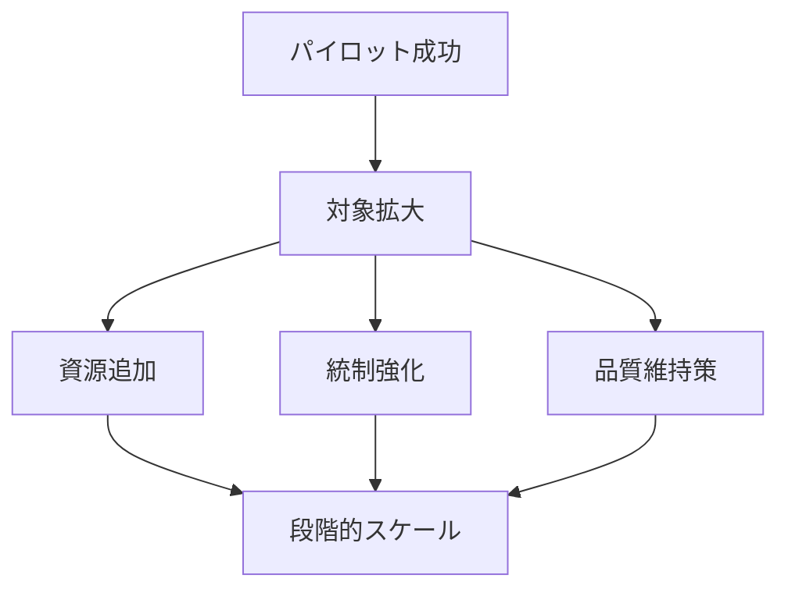

---  
layer: note  
folder: thinking_engine/solution_design  
status: stable  
updated: 2026-03-14  

---  
  
# スケール設計  
  
スケール設計とは、パイロットで確認した解決策を、より広い対象・大きな規模・長い期間へ拡張する際に必要な条件を設計することである。  
  
小さく回るものが、そのまま大きく回るとは限らない。    
規模拡大では、人員、統制、品質、例外処理、教育、記録、インフラの問題が新たに発生しやすい。  
  
---  
  
## 役割  
  
- 拡張時の崩れ方を先に考える  
- 必要資源の増加を見積もる  
- 品質維持方法を設計する  
- 統制と柔軟性のバランスを取る  
- 段階的拡張の道筋を作る  
  
---  
  
## 何を見るか  
  
- 何が増えるか  
- 何が壊れやすくなるか  
- 誰を追加する必要があるか  
- 品質をどう保つか  
- 例外処理をどう標準化するか  
- どの条件で次段階へ進むか  
  
---  
  
## 基本構造  
  

---

## テンプレート

- 対象解決策:    
- スケール対象:    
- 増加要素:    
- 必要資源:    
- 追加主体:    
- 品質維持策:    
- 統制方法:    
- 想定ボトルネック:    
- スケール条件:    
- 段階的拡張案:    
- 拡張停止条件:    

---

## 注意点

- パイロット成功をそのまま一般化しない    
- 規模拡大で壊れる部分を先に見る    
- 人と仕組みの両方を拡張する    
- 例外処理を属人化させない