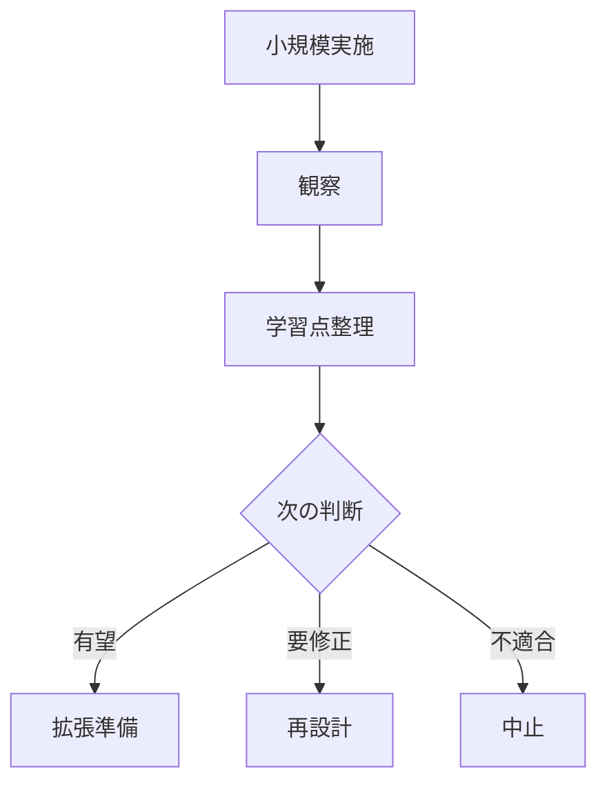

---  
layer: note  
folder: thinking_engine/solution_design  
status: stable  
updated: 2026-03-14

---  
  
# パイロット設計  
  
パイロット設計とは、解決策を小規模・限定条件下で試し、主要仮説や運用課題を確認するための設計である。  
  
最初から全面展開せず、限定的に試すことで、失敗コストを抑えながら学習を得られる。    
このノートは、単なる「お試し」ではなく、「何を学ぶために、どこまで試すか」を明確にする。  
  
---  
  
## 役割  
  
- 小さく試して大きな失敗を避ける  
- 実運用上の詰まりを早期に見つける  
- 仮説検証と現場検証を両立する  
- 本番展開前の修正材料を得る  
- 次段階への条件を整える  
  
---  
  
## 何を見るか  
  
- 何を試すか  
- 何を学びたいか  
- 対象範囲はどこまでか  
- 成功条件は何か  
- 中止条件は何か  
- 本番との差は何か  
  
---  
  
## 基本構造  
  

---

## テンプレート

- 対象解決策:    
- パイロットの目的:    
- 対象範囲:    
- 期間:    
- 参加主体:    
- 観察指標:    
- 成功条件:    
- 修正条件:    
- 中止条件:    
- 学びの記録:    
- 次段階条件:    

---

## 注意点

- 小さすぎて何も学べない試験にしない    
- 本番条件と乖離しすぎない    
- 見たい論点を増やしすぎない    
- パイロット結果をそのまま一般化しない