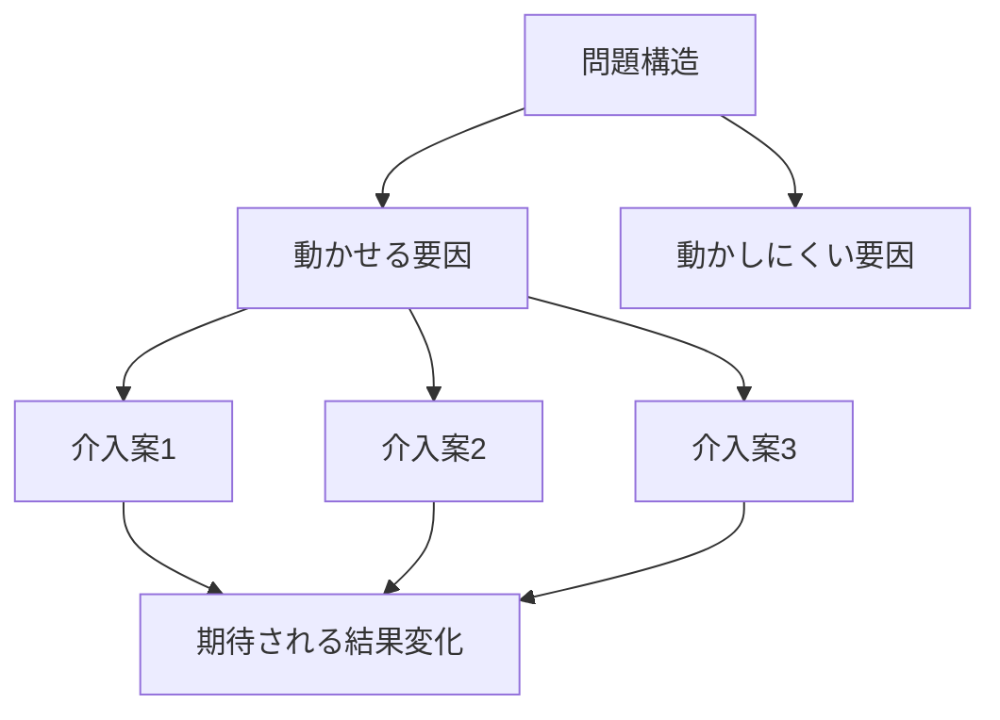

---  
layer: note  
folder: thinking_engine/solution_design  
status: stable  
updated: 2026-03-14  

---  
  
# 介入レバー設計  
  
介入レバー設計とは、問題構造の中で、どの変数・行動・制度・情報・資源配分を動かせば結果が変わるかを定めることである。  
  
原因を知ることと、変えられる点を知ることは別である。    
このノートは「何が原因か」ではなく、「どこを動かすと現実が変わるか」に焦点を当てる。  
  
---  
  
## 役割  
  
- 動かせる要因を特定する  
- 効きやすい介入点を見つける  
- 高インパクトと低コストの違いを整理する  
- 副作用の大きい介入を見抜く  
- 実装可能なレバーから優先順位をつける  
  
---  
  
## レバーの典型類型  
  
- 情報  
- インセンティブ  
- ルール  
- 権限  
- 配置  
- フロー  
- UI  
- 教育  
- 監視  
- フィードバック頻度  
- 資源配分  
- 標準化  
  
---  
  
## 基本構造  
  

---

## テンプレート

- 目標結果:    
- 現在の因果構造:    
- 動かせる要因:    
- 動かしにくい要因:    
- 最小介入点:    
- 高インパクト介入点:    
- 実装しやすい介入点:    
- 副作用:    
- 優先介入案:    
- 観察すべき変化:    

---

## 注意点

- 動かせない原因ばかり追わない    
- 効きそうでも実装不能なら設計として弱い    
- 小さい介入でも連鎖的に効くことがある    
- 介入レバーとKPIを結びつけて考える