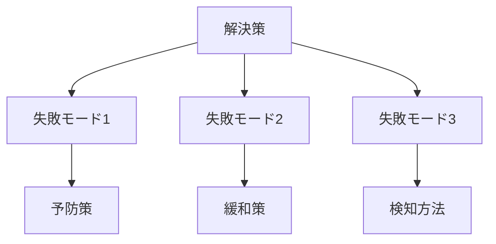

---  
layer: note  
folder: thinking_engine/solution_design  
status: stable  
updated: 2026-03-14 

---  
  
# 失敗モード分析  
  
失敗モード分析とは、解決策がどのように壊れうるか、どの地点で失敗しやすいかを事前に洗い出すことである。  
  
設計段階で失敗モードを想定しておくことで、脆弱点の補強、監視ポイントの明確化、例外処理の整備が可能になる。  
  
---  
  
## 役割  
  
- 想定外を減らす  
- 脆弱点を先に見つける  
- 人のミス以外の失敗も捉える  
- 予防策と緩和策を分けて考える  
- 実装前に設計品質を上げる  
  
---  
  
## 見るべき点  
  
- どこで止まるか  
- どこで誤作動するか  
- 誰が詰まるか  
- 何が誤解されるか  
- 何が副作用になるか  
- 何が隠れた損失になるか  
  
---  
  
## 基本構造  
  

---

## テンプレート

- 解決策:    
- 想定失敗モード1:    
- 想定失敗モード2:    
- 想定失敗モード3:    
- 発生原因:    
- 影響:    
- 検知方法:    
- 予防策:    
- 緩和策:    
- 残余リスク:    

---

## 注意点

- 人の注意不足だけに還元しない    
- UI、情報、制度、運用、引継ぎの失敗も見る    
- 検知不能な失敗を特に警戒する    
- 稀でも致命的な失敗は重く扱う