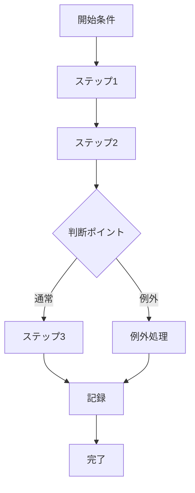

  ---  
layer: note  
folder: thinking_engine/solution_design  
status: stable  
updated: 2026-03-14  

---  
  
# 実行プロセス設計  
  
実行プロセス設計とは、解決策を実際に回すために、誰が、いつ、何を、どの順で行うかを定義することである。  
  
仕組みとして筋が通っていても、現場で回らなければ意味がない。    
このノートでは、抽象的な構造ではなく、運用可能な手順に落とし込むことが中心となる。  
  
---  
  
## 役割  
  
- 手順を具体化する  
- 担当主体を明確にする  
- 判断ポイントを明示する  
- 例外処理を織り込む  
- 記録と受け渡しを設計する  
  
---  
  
## 主要観点  
  
- 開始条件  
- 担当者  
- 実行順序  
- 判断ポイント  
- 例外処理  
- エスカレーション  
- 記録  
- 完了条件  
  
---  
  
## 基本構造  
  

---

## テンプレート

- 開始条件:    
- 担当者:    
- ステップ1:    
- ステップ2:    
- ステップ3:    
- 判断ポイント:    
- 例外時対応:    
- エスカレーション先:    
- 記録項目:    
- 完了条件:
- 次工程への受け渡し:    

---

## 注意点

- 暗黙の前提に依存しない    
- 例外時対応を書かないと現場で崩れる    
- 善意や属人性に依存しすぎない    
- 記録が後工程にどう使われるかを意識する