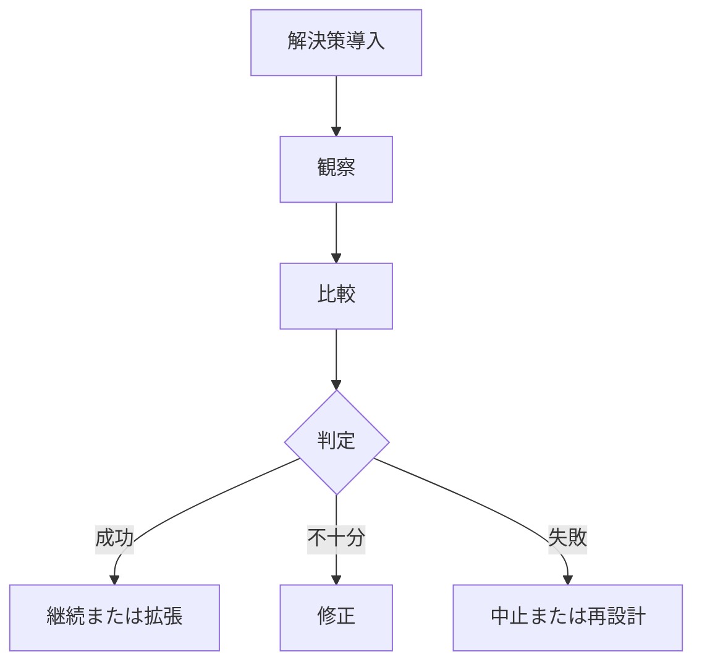

---  
layer: note  
folder: thinking_engine/solution_design  
status: stable  
updated: 2026-03-14  

---  
  
# 検証設計  
  
検証設計とは、解決策が本当に効いているかを判断するために、何をどう観察し、何と比較し、どの条件で成功または失敗とみなすかを定めることである。  
  
導入しただけで満足しないための設計であり、solution_design の中でも特に学習と改善の起点になる。  
  
---  
  
## 役割  
  
- 成功の定義を明確にする  
- 効果検証の方法を定める  
- 比較対象を決める  
- 副作用の観測を組み込む  
- 継続・修正・中止の判断材料を作る  
  
---  
  
## 何を見るか  
  
- 成功条件  
- 比較対象  
- 観察期間  
- 効果発現ラグ  
- 副作用  
- 継続条件  
- 中止条件  
  
---  
  
## 基本構造  
  

---

## テンプレート

- 対象施策:    
- 検証目的:    
- 主要指標:    
- 比較対象:    
- 観察期間:    
- 期待変化:    
- 想定副作用:    
- 継続条件:    
- 修正条件:    
- 中止条件:    
- 次に見るべき論点:    

---

## 注意点

- 効果と副作用を分けて観る    
- 導入直後のノイズで結論を急がない    
- 比較対象なしに「効いた」と言い切らない    
- 成功条件を後出しにしない