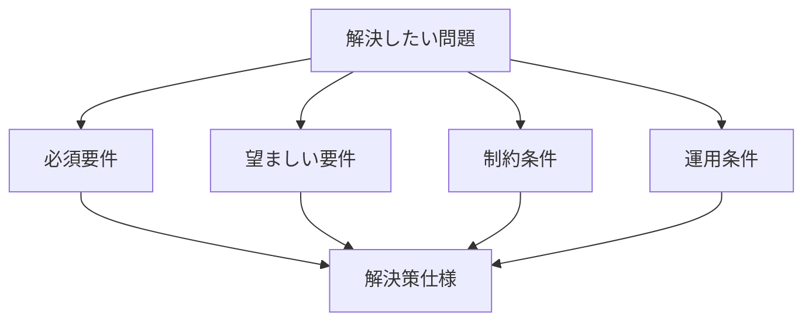

  
---  
layer: note  
folder: thinking_engine/solution_design  
status: stable  
updated: 2026-03-14  

---  
  
# 要件定義  
  
要件定義とは、解決策が満たすべき条件を明確にすることである。  
  
良い解決策は、先に「何を満たせばよいか」が定義されている。    
逆に、要件が曖昧なまま作られた解決策は、あとから目的逸脱や運用破綻を起こしやすい。  
  
---  
  
## 役割  
  
- 解決策の成功条件を明文化する  
- 必須条件と希望条件を分ける  
- 制約条件を先に明らかにする  
- 現場運用の前提を入れる  
- 法制度や組織条件との衝突を避ける  
  
---  
  
## 要件の典型分類  
  
- 機能要件  
- 非機能要件  
- 制約条件  
- 法制度要件  
- ユーザー要件  
- 組織要件  
- 運用要件  
- 安全要件  
- コスト要件  
  
---  
  
## 基本構造  
  

---

## テンプレート

- 解決したい問題:    
- 想定利用者:    
- 必須機能:    
- 望ましい機能:    
- 非機能要件:    
- 制約:    
- 法制度条件:    
- 組織条件:    
- 運用条件:    
- 安全条件:    
- 成功条件:    
- 今回扱わない範囲:    

---

## 注意点

- 要件と手段を混同しない    
- 「便利そう」を要件と呼ばない    
- 現場制約を書かずに理想設計にしない    
- 後から足されそうな必須要件を先に掘り出す