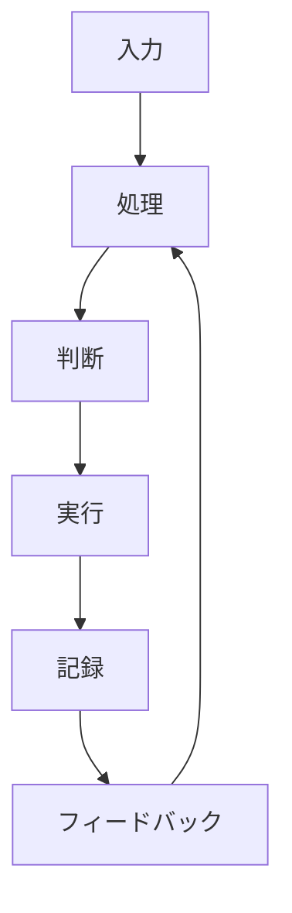

---  
layer: note  
folder: thinking_engine/solution_design  
status: stable  
updated: 2026-03-14  

---  
  
# 解決策アーキテクチャ  
  
解決策アーキテクチャとは、複数の施策・主体・情報・判断・実行・記録を、一つの系として整合的に接続する設計である。  
  
単発の施策は、単発の効果しか持たないことが多い。    
一方、アーキテクチャとして設計された解決策は、入力からフィードバックまでを持ち、継続運用や改善が可能になる。  
  
---  
  
## 役割  
  
- 解決策を部品の寄せ集めにしない  
- 入力から改善までを一つの流れにする  
- 主体と情報経路を明示する  
- ボトルネックと脆弱点を見つける  
- 改善可能な仕組みにする  
  
---  
  
## 基本構造  
  

---

## 典型構成要素

- 入力    
- 中核処理    
- 判断点    
- 実行主体    
- 記録系    
- フィードバック系    
- 例外処理    
- 代替経路    

---

## テンプレート

- 解決策名:    
- 入力:    
- 中核処理:    
- 判断主体:    
- 実行主体:    
- 記録方法:    
- フィードバック経路:    
- 例外処理:    
- 代替経路:    
- ボトルネック:    
- 壊れやすい箇所:    

---

## 注意点

- 主体不明の工程を残さない    
- フィードバックのない構造にしない
- 処理系と判断系を混ぜすぎない    
- 一箇所停止で全体停止する設計に注意する