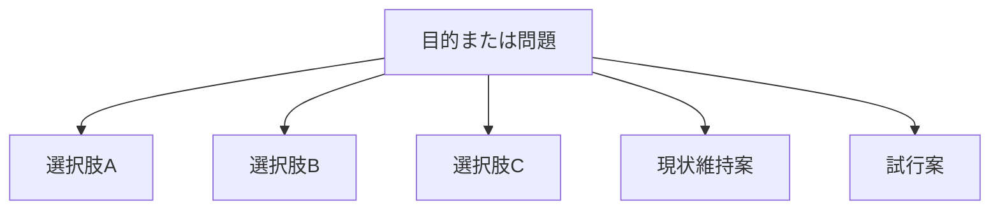

  
# 選択肢生成  
  
選択肢生成とは、目的や問題に対して取りうる行動案・方針案・戦略案を、比較可能な形で列挙することである。  
  
良い意思決定は、良い比較対象があって初めて成り立つ。  
したがって、このノートの役割は「すぐ決めること」ではなく、「決めるに値する案を十分に揃えること」にある。  
  
---  
  
## 役割  
  
- 早すぎる一本化を防ぐ  
- 現状維持も含めて比較対象を作る  
- 実行案の幅を確保する  
- ハイブリッド案や段階案を見つける  
- decision 全体の質を底上げする  
  
---  
  
## 選択肢の典型類型  
  
- 現状維持  
- 漸進改善  
- 部分転換  
- 全面転換  
- 試行導入  
- 一時停止  
- 外部委託  
- 内製化  
- 縮小運用  
- 撤退  
- ハイブリッド案  
  
---  
  
## 基本構造  
  

---

## テンプレート

- 目的:    
- 制約:    
- 選択肢A:    
- 選択肢B:    
- 選択肢C:    
- 現状維持案:    
- 試行案:    
- ハイブリッド案:    
- 比較のために不足している案:    
- 生成時点での直感:    

---

## 良い選択肢の条件

- 実際に比較可能である    
- 互いの差が明確である    
- 同じ目的に向いている    
- 実行条件が書ける    
- 現実案と理想案が混ざっていない    

---

## 注意点

- 実質一択なのに比較しているふりをしない    
- 現状維持を無意識に除外しない    
- 逆に、非現実案だけで埋めない    
- 案の違いが基準の違いになっていないか確認する