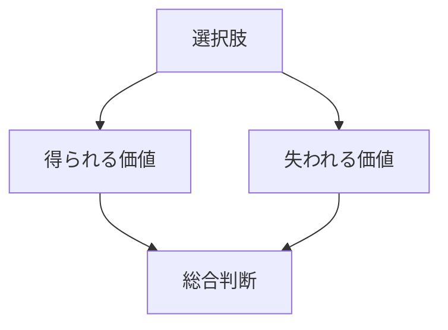

---

layer: note  
folder: thinking_engine/decision  
status: stable  
updated: 2026-03-14  

---
  
# トレードオフ分析  
  
トレードオフ分析とは、ある選択肢を採ることで得られる価値と、同時に失われる価値を明示することである。  
  
現実の意思決定では、全てを最大化できることは稀である。  
したがって、何を優先し、何を犠牲にし、どの損失が許容可能で、どの損失が許容不可能かを整理する必要がある。  
  
---  
  
## 役割  
  
- 見えにくい損失を可視化する  
- 得失の交換関係を明確にする  
- 不可逆な損失を見落とさない  
- 短期利益と長期損失のズレを明示する  
- 意思決定後の後悔ポイントを先に見る  
  
---  
  
## 何を見るか  
  
- 何を得るか  
- 何を失うか  
- どの損失は回復可能か  
- どの損失は不可逆か  
- 時間差で現れる損益は何か  
- 誰にとっての得失か  
  
---  
  
## 基本構造  
  

---

## テンプレート

- 選択肢:    
- 得られるもの:    
- 失うもの:    
- 短期メリット:    
- 長期メリット:    
- 短期コスト:    
- 長期コスト:    
- 可逆な損失:    
- 不可逆な損失:    
- 利害関係者別の得失:    
- 総合判断:    

---

## 典型的な論点

- 速度 vs 精度    
- 効果 vs コスト    
- 拡張性 vs 単純性    
- 自由度 vs 統制    
- 内製化 vs 外部依存    
- 短期成果 vs 長期基盤整備    

---

## 注意点

- 得るものだけを書かない    
- 「失うものが少ない」ことと「良い案」を混同しない    
- 誰の得か、誰の損かを曖昧にしない    
- 不可逆な損失は特に重く扱う