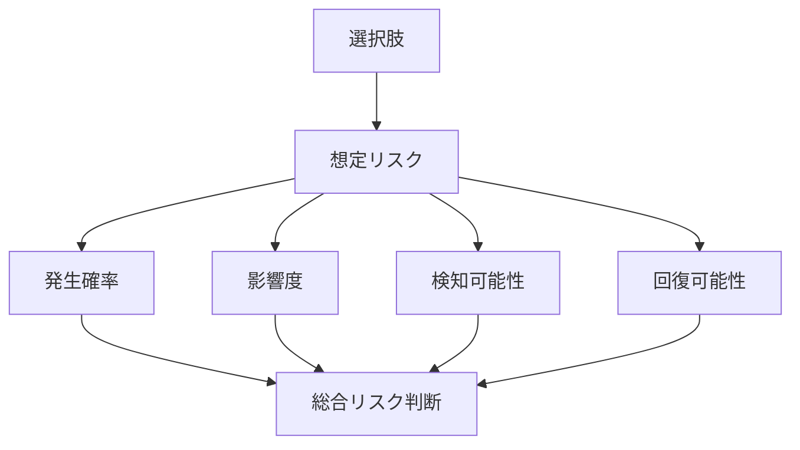

  
# リスク評価  
  
リスク評価とは、選択肢ごとに、どのような失敗が起こりうるか、その発生確率・影響度・検知可能性・回復可能性を整理することである。  
  
意思決定では、期待される利益だけでなく、最悪ケース、崩れ方、復旧可能性を考える必要がある。  
  
---  
  
## 役割  
  
- 過度な楽観を防ぐ  
- 最悪ケースを先に想定する  
- 予防策と緩和策を分ける  
- 見えやすいリスク偏重を防ぐ  
- 選択肢比較に安全性の観点を導入する  
  
---  
  
## 主な観点  
  
- 発生確率  
- 影響度  
- 検知可能性  
- 回復可能性  
- 波及範囲  
- 発生速度  
- 隠れやすさ  
  
---  
  
## 基本構造  
  

---

## テンプレート

- 選択肢:    
- 主なリスク:    
- 発生確率:    
- 影響度:    
- 早期兆候:    
- 検知方法:    
- 予防策:    
- 緩和策:    
- 回復可能性:    
- 最悪ケース:    
- 総合判断:    

---

## 典型リスク

- 実行不能    
- コスト超過    
- スケジュール遅延    
- 品質低下    
- 利害関係者反発    
- 法制度不適合    
- 運用定着失敗    
- 一部成功・全体失敗    
- 拡張不能    
- 評判毀損    

---

## 注意点

- 確率が低いだけで無視しない    
- 致命傷リスクと軽微リスクを同列に扱わない    
- 見えやすいリスクだけを重視しない    
- 「何とかなる」で終わらせない