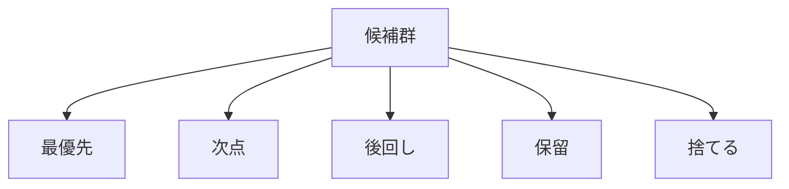

  
# 優先順位決定  
  
優先順位決定とは、複数の候補のうち、何を先に進め、何を後回しにし、何を捨てるかを決めることである。  
  
良い案が複数あっても、資源が有限なら全て同時には進められない。  
したがって、優先順位は「価値判断」だけでなく、「資源配分の設計」でもある。  
  
---  
  
## 役割  
  
- 実行順序を決める  
- 資源集中先を決める  
- 後回しにする理由を明示する  
- 捨てる対象を決める  
- 見直し条件を定める  
  
---  
  
## 何を見るか  
  
- インパクト  
- 緊急性  
- 実行容易性  
- 依存関係  
- リスク低減効果  
- 学習価値  
- 可逆性  
- 資源消費量  
  
---  
  
## 基本構造  
  

---

## テンプレート

- 候補一覧:    
- 最優先:    
- 次点:    
- 後回し:    
- 保留:    
- 捨てるもの:    
- 判断理由:    
- 依存関係:    
- 見直し条件:    

---

## 典型判断軸

- 今やらないと損失が大きいか    
- 先にやると後続が楽になるか    
- 小さく始めて学べるか    
- コストの割に効果が大きいか    
- 致命的なリスクを減らせるか    

---

## 注意点

- 緊急と重要を混同しない    
- 声の大きい案件が上に来やすいことに注意する    
- 「全部大事」を放置しない    
- 優先順位は固定ではなく、状況依存で見直す