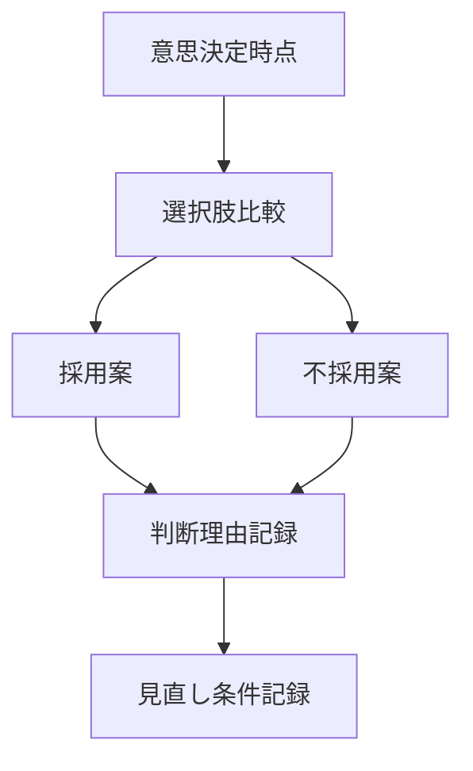

  
# 意思決定記録  
  
意思決定記録とは、何を、なぜ、その時点で採用または不採用にしたのかを残すことである。  
  
記録がないと、後から結果だけを見て過去の判断を誤読しやすい。    
また、判断の更新も、失敗からの学習も難しくなる。  
  
---  
  
## 役割  
  
- 判断過程を後から検証可能にする  
- 結果論による改ざんを防ぐ  
- 見直し時の起点を残す  
- 共有判断の透明性を上げる  
- 学習資産を蓄積する  
  
---  
  
## 記録すべき項目  
  
- 何を決めたか  
- いつ決めたか  
- 何と比較したか  
- なぜ採用したか  
- なぜ不採用にしたか  
- その時点の不確実性  
- 想定リスク  
- 見直し条件  
  
---  
  
## 基本構造  
  

---

## テンプレート

- 決定事項:    
- 日時:    
- 背景:    
- 比較した選択肢:    
- 採用理由:    
- 不採用理由:    
- 当時の不確実性:    
- 想定リスク:    
- 見直し条件:    
- 次回確認日:    
- 担当者:    

---

## 注意点

- 事後合理化しない    
- 結果が悪かったことと判断が悪かったことを混同しない    
- 簡潔でよいので残さないことを避ける    
- 当時見えていなかった情報を後から混入させない