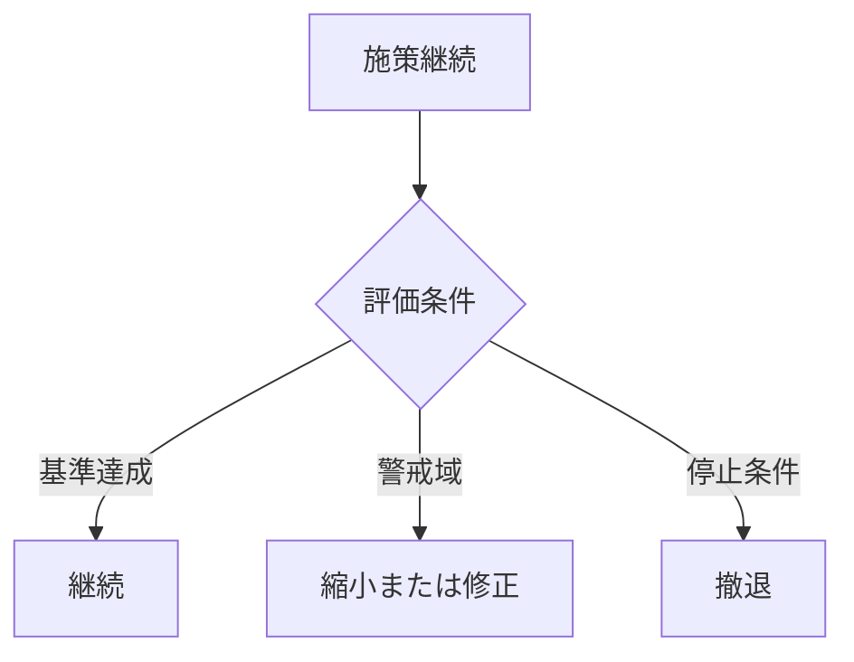

  
# 撤退基準設計  
  
撤退基準設計とは、どの条件になったら、選んだ方針や施策を中止・縮小・変更するかを事前に決めておくことである。  
  
撤退基準がないと、失敗している案に対しても、過去投入コストや感情的執着のために資源を流し続けやすい。    
そのため、decision は採用判断だけでなく、やめる条件まで含めて設計されるべきである。  
  
---  
  
## 役割  
  
- 損切りの遅れを防ぐ  
- サンクコストへの執着を抑える  
- 継続・縮小・停止の線を明確にする  
- 感情判断ではなく条件判断にする  
- 再挑戦条件を整える  
  
---  
  
## 何を見るか  
  
- どの指標が閾値を下回ったらやめるか  
- どの期間改善しなければ見直すか  
- どのリスク発生で即停止か  
- 部分撤退と全面撤退を分けるか  
- 再挑戦の条件はあるか  
  
---  
  
## 基本構造  
  

---

## テンプレート

- 対象施策:    
- 継続条件:    
- 警戒条件:    
- 撤退条件:    
- 即時停止条件:    
- 判定時期:    
- 判定主体:    
- 縮小案:    
- 修正案:    
- 再挑戦条件:    
- 学びの記録方法:    

---

## 典型的な撤退条件

- KPI が一定期間改善しない    
- 想定コストを一定以上超過した    
- 法的・安全上の重大リスクが顕在化した    
- 運用主体が回らない    
- 主要前提が崩れた    
- 代替案が明確に優位になった    

---

## 注意点

- 撤退を敗北とみなさない    
- 一発退場条件と段階修正条件を分ける    
- 基準を曖昧にすると結局やめられない    
- 学びを回収しない撤退は損失が大きい