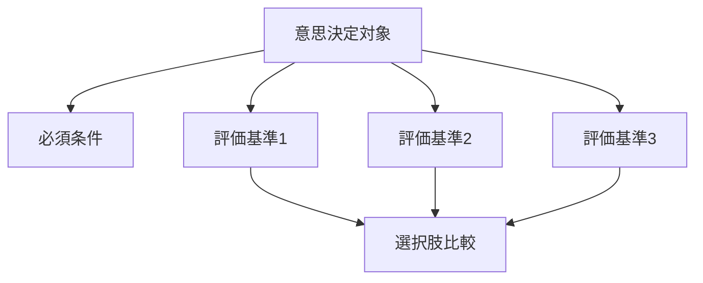

  
# 評価基準設計  
  
評価基準設計とは、複数の選択肢を何によって評価するかを明示することである。  
  
判断の質は、選択肢の質だけでなく、基準の質によって大きく左右される。  
基準が曖昧だと、比較は形式だけになり、最終的には雰囲気・好み・惰性で決まりやすい。  
  
---  
  
## 役割  
  
- 比較の軸を揃える  
- 判断の恣意性を減らす  
- 必須条件と加点条件を分ける  
- 短期最適と長期最適を分ける  
- 利害関係者間の認識差を明らかにする  
  
---  
  
## 典型基準  
  
- 効果  
- 実現可能性  
- コスト  
- 所要時間  
- リスク  
- 可逆性  
- 拡張性  
- 学習価値  
- 利害関係者受容性  
- 法制度適合性  
- ブランド整合性  
- 維持運用負荷  
  
---  
  
## 基本構造  
  

---

## テンプレート

- 意思決定対象:    
- 必須条件:    
- 禁止条件:    
- 評価基準1:    
- 評価基準2:    
- 評価基準3:    
- 重みづけ:    
- 判定方法:    
- 判断主体:    
- 評価の留保点:    

---

## 良い基準の条件

- 比較に使えるほど具体的である    
- 重複が少ない    
- 必須条件と加点条件が分かれている    
- 短期と長期を混同しない    
- 価値判断が隠れていない    

---

## 注意点

- 効果だけで決めない    
- 使いやすさと低コストを同一視しない    
- 本当は重要な基準を暗黙化しない    
- 重みづけを後出しにしない