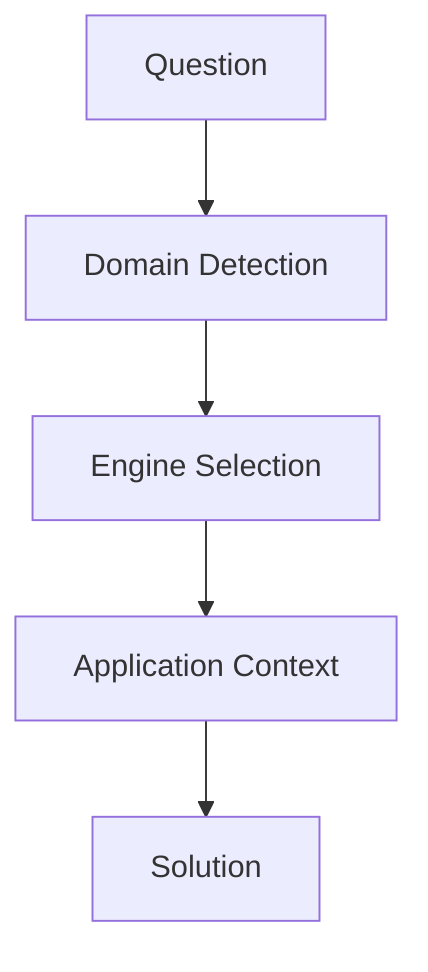

# 基本構造



---

# 固有構造
```mermaid
flowchart TD
[law] --> [normative]
[history] --> [causal]
[business] --> [decision]
[geography] --> [spatial]
[geogpaphy] --> [network]
[tourism] --> [evaluation]
[tourism] --> [spatial]
[story] --> [meaning]
[story] --> [temporal]
[story] --> [expression]
[story] --> [causual]
[story] --> [evaluation]
[reading] --> [interpretation]
[photography] --> [expression]
[photography] --> [evaluation]
[music] --> [temporal]
[music] --> [expression]
[fashion] --> [expression]
[fashion] --> [evaluation]
[tourism_philosophy] --> [meaning]
```
