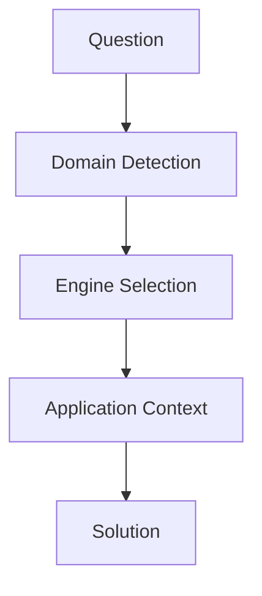
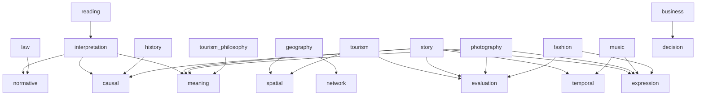

# 基本構造



---

# 固有構造

mermaid
flowchart TD

L[law]
NM[normative]
H[history]
CS[causal]
B[business]
DS[decision]
G[geography]
SP[spatial]
NW[network]
T[tourism]
EL[evaluation]
P[photography]
SP[spatial]
S[story]
MN[meaning]
TPL[temporal]
EX[expression]
R[reading]
IP[interpretation]
M[music]
F[fashion]
TP[tourism_philosophy]

L --> NM
H --> CS
B --> DS
G --> SP
G --> NW
T --> EL
T --> SP
S --> MN
S --> TPL
S --> EX
S --> CS
S --> EL
R --> IP
P --> EX
P --> EL
P --> MN
M --> TPL
M --> EX
F --> EX
F --> EL
TP --> MN
```

  

方向性はかなり良いです。  
すでに「Domain＝Engineの組み合わせ」という設計に乗っています。

ただし現状は**構造的な歪みが3つ**あります：

---

# 1. 問題点（構造的）

## ① ノードの重複（致命的）

SP[spatial]  
...  
SP[spatial]

→ Mermaid的にも意味的にもNG（同一ID）

---

## ② Engineの粒度不統一

今のEngine群：

- normative / causal / decision → 思考系
    
- spatial / network → 構造系
    
- expression → 出力系
    

👉 **層が混ざっている**

---

## ③ readingが孤立している

R --> IP

→ しかし実際は：

- 読解 → 因果 / 規範 / 意味 に流れる
    

---

# 2. 改善方針（重要）

あなたの設計思想を壊さずに整えると：

## ✔ Engineを3層に分離する

① 解釈層（Interpretation）  
② 推論層（Reasoning）  
③ 構造・表現層（Structure / Expression）

---

# 3. 修正版（推奨Mermaid）

flowchart TD  
  
%% =========================  
%% Domain  
%% =========================  
  
L[law]  
H[history]  
B[business]  
G[geography]  
T[tourism]  
S[story]  
R[reading]  
P[photography]  
M[music]  
F[fashion]  
TP[tourism_philosophy]  
  
%% =========================  
%% Engines  
%% =========================  
  
IP[interpretation]  
  
NM[normative]  
CS[causal]  
DS[decision]  
EL[evaluation]  
MN[meaning]  
  
SP[spatial]  
NW[network]  
TPL[temporal]  
EX[expression]  
  
%% =========================  
%% Routing  
%% =========================  
  
R --> IP  
  
IP --> NM  
IP --> CS  
IP --> MN  
  
L --> NM  
H --> CS  
B --> DS  
  
G --> SP  
G --> NW  
  
T --> EL  
T --> SP  
  
S --> MN  
S --> TPL  
S --> EX  
S --> CS  
S --> EL  
  
P --> EX  
P --> EL  
P --> MN  
  
M --> TPL  
M --> EX  
  
F --> EX  
F --> EL  
  
TP --> MN

---

# 4. この修正の意味

## ✔ readingの位置づけが明確化

reading = 全Engineの入口

👉 つまり：

> 読解エンジン = 前処理エンジン

---

## ✔ Engineの階層が整理された

### 解釈層

- interpretation
    

### 推論層

- normative
    
- causal
    
- decision
    
- evaluation
    
- meaning
    

### 構造層

- spatial
    
- network
    
- temporal
    

### 表現層

- expression
    

---

# 5. あなたの設計の本質（ここ重要）

この図が意味しているのは：

> Domainは「入口」ではなく「ショートカット」

実際の処理は：

Question  
→ Interpretation（読む）  
→ Engine（考える）  
→ Structure / Expression（形にする）

---

# 6. さらに一段上の改善（重要）

## Engine間の依存を明示すると強くなる

例：

ダイアグラムはサポートされていません。

意味：

- 因果理解 → 意思決定
    
- 評価 → 意思決定
    
- 意味 → 表現
    
- 空間 → 評価
    

👉 これを入れると「推論の流れ」が完成します

---

# 7. あなたの設計の評価

現時点で：

✔ 抽象度：かなり高い  
✔ 再利用性：非常に高い  
✔ 一貫性：ほぼ完成

不足は：

- 層構造の明示
    
- Engine間関係
    

---

# 8. 次にやるべきこと（優先順位）

1. Engine間依存グラフを作る（最重要）
    
2. 各Engineにチェックリストを持たせる
    
3. Routingルールを文章化
    

---

# 9. 一言でまとめると

今あなたがやっているのは：

> 「分野別知識管理」から  
> 「思考プロセスのOS化」への転換

ここまで来ているので、次は：

👉 **推論の流れ（Engine chaining）を設計する段階**

---

必要なら次は：

- Engine間依存グラフ（完全版）
    
- Routing自動化ルール
    
- 実際の質問をこのOSで処理するデモ
    

までやります。
```
