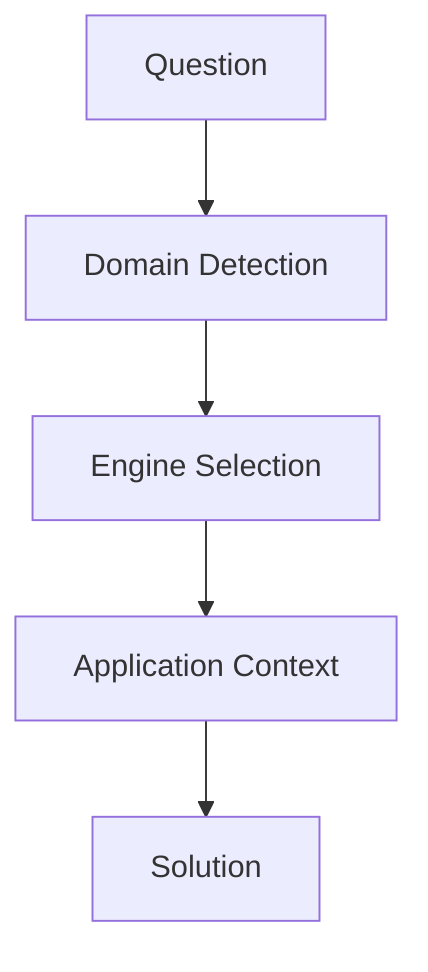
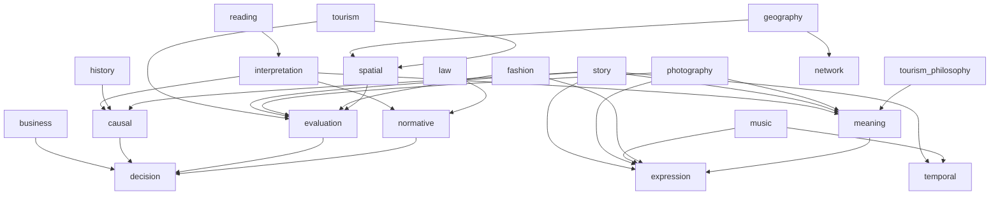

# 基本構造

```mermaid
flowchart TD  
  
Q[Question]  
  
Q --> D[Domain Detection]  
  
D --> E[Engine Selection]  
  
E --> A[Application Context]  
  
A --> Solution
```

---

# 固有構造

```mermaid
flowchart TD  
  
%% =========================  
%% Domain  
%% =========================  
  
L[law]  
H[history]  
B[business]  
G[geography]  
T[tourism]  
S[story]  
R[reading]  
P[photography]  
M[music]  
F[fashion]  
TP[tourism_philosophy]  
  
%% =========================  
%% Engines  
%% =========================  
  
IP[interpretation]  
  
NM[normative]  
CS[causal]  
DS[decision]  
EL[evaluation]  
MN[meaning]  
  
SP[spatial]  
NW[network]  
TPL[temporal]  
EX[expression]  
  
%% =========================  
%% Routing  
%% =========================  
  
R --> IP  
  
IP --> NM  
IP --> CS  
IP --> MN  
  
L --> NM  
H --> CS  
B --> DS  
  
G --> SP  
G --> NW  
  
T --> EL  
T --> SP  
  
S --> MN  
S --> TPL  
S --> EX  
S --> CS  
S --> EL  
  
P --> EX  
P --> EL  
P --> MN  
  
M --> TPL  
M --> EX  
  
F --> EX  
F --> EL  
  
TP --> MN

%% =========================  
%% InterEngine  
%% =========================  

CS --> DS  
EL --> DS  
MN --> EX  
SP --> EL
NM --> DS
```

# Routing ルール
## Engine Hub
[[Engine Hub]]