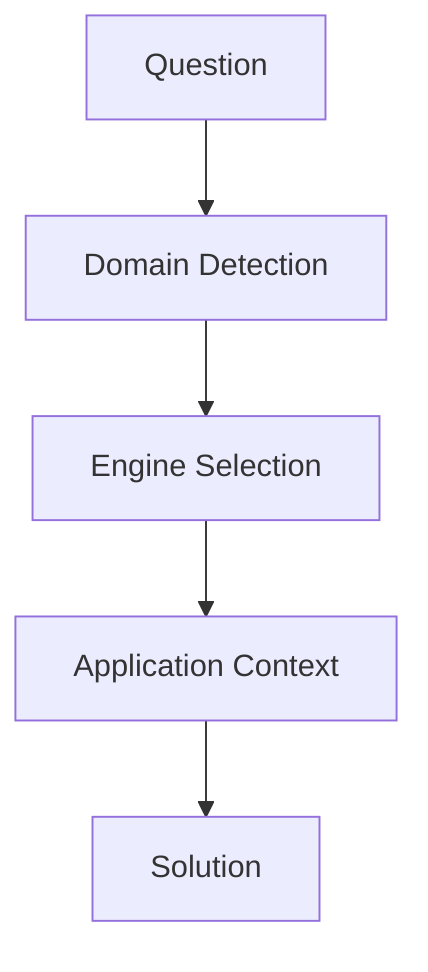

# 基本構造



---

# 固有構造
```mermaid
law --> normative
history --> causal
business → decision
geography → spatial + network
tourism → evaluation + spatial
story → meaning + temporal
reading → interpretation
photography → expression
music → temporal
fashion → expression + evaluation
philosophy（旅） → meaning
```