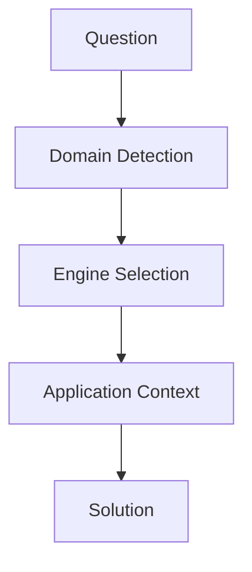

# 基本構造



---

# 固有構造
```mermaid
flowchart TD

L[law] --> NM[normative]
H[history] --> CS[causal]
B[business] --> DS[decision]
G[geography] --> SP[spatial]
[geogpaphy] --> NW[network]
T[tourism] --> EL[evaluation]
[tourism] --> SP[spatial]
S[story] --> [meaning]
[story] --> TP[temporal]
[story] --> EX[expression]
[story] --> [causual]
[story] --> [evaluation]
E[reading] --> IP[interpretation]
P[photography] --> [expression]
[photography] --> [evaluation]
M[music] --> [temporal]
[music] --> [expression]
F[fashion] --> [expression]
[fashion] --> [evaluation]
TP[tourism_philosophy] --> MN[meaning]

L --> NM
```
