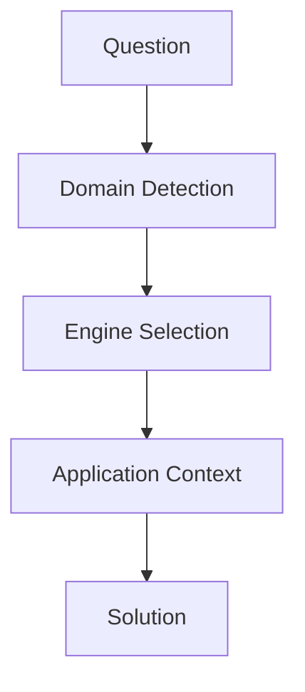

# 基本構造



---

# 固有構造
```mermaid
flowchart TD

L[law] --> [normative]
H[history] --> [causal]
B[business] --> [decision]
G[geography] --> [spatial]
[geogpaphy] --> [network]
T[tourism] --> [evaluation]
[tourism] --> [spatial]
S[story] --> [meaning]
[story] --> [temporal]
[story] --> [expression]
[story] --> [causual]
[story] --> [evaluation]
E[reading] --> [interpretation]
P[photography] --> [expression]
[photography] --> [evaluation]
M[music] --> [temporal]
[music] --> [expression]
F[fashion] --> [expression]
[fashion] --> [evaluation]
TP[tourism_philosophy] --> [meaning]
```
