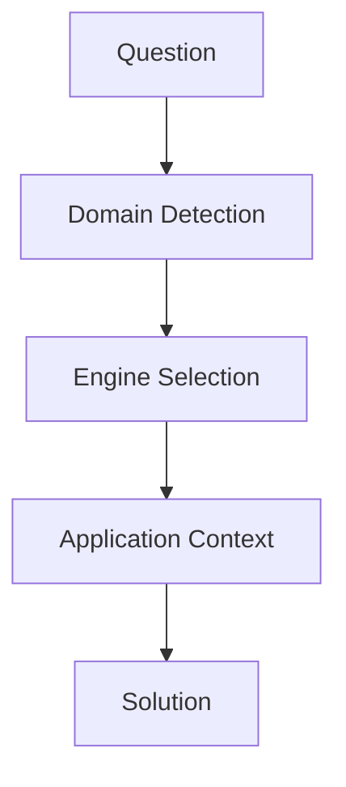

# 基本構造



---

# 固有構造
```mermaid
law --> normative
history --> causal
business --> decision
geography --> spatial
geogpaphy --> network
tourism --> evaluation
tourism --> spatial
story --> meaning
story --> temporal
reading --> interpretation
photography --> expression
music --> temporal
fashion --> expression
fashion --evaluation
philosophy（旅） → meaning
```