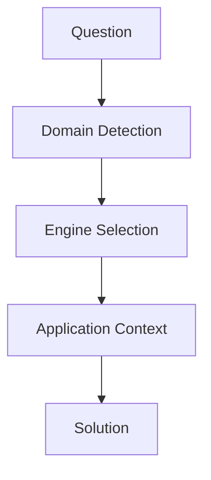

# 基本構造



---

# 固有構造
```mermaid
flowchart TD

L[law]
NM[normative]
H[history]
CS[causal]
B[business]
DS[decision]
G[geography]
SP[spatial]
NW[network]
T[tourism]
EL[evaluation]
SP[spatial]
S[story]
MN[meaning]
TP[temporal]
EX[expression]
R[reading]
IP[interpretation]
M[music] --> [temporal]
[music] --> [expression]
F[fashion] --> [expression]
[fashion] --> [evaluation]
TP[tourism_philosophy] --> MN[meaning]

L --> NM
H --> CS
B --> DS
G --> SP
G --> NW
T --> EL
T --> SP
S --> MN
S --> TP
S --> EX
S --> CS
S --> EL
R --> IP
P --> EX
P --> EL
M --> TP
M -->EX

```
