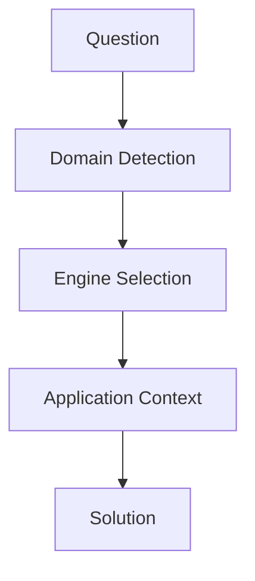
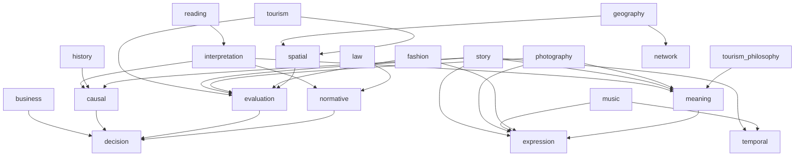

# 基本構造

---

# 固有構造

# Routing ルール
## Engine Hub
[[Engine Hub]]に則る。

## Question Type Routing

- なぜ？ → causal
- どうすべき？ → decision
- 正しい？ → normative
- どちらが良い？ → evaluation
- どういう意味？ → meaning
- どう構成されている？ → spatial / temporal
- どう表現する？ → expression
- 文章を理解したい → interpretation

## Execution Flow

1. Questionを書く
2. Interpretationを通す（必須）
3. Question Typeを判定
4. Engineを選択
5. 必要なら複数Engineを連結
6. Expressionで出力