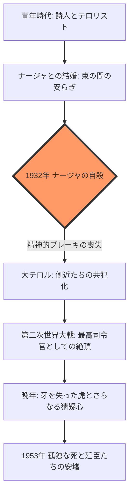

# スターリン：赤い皇帝と廷臣たち｜構造的読書ノート

## 1. 全体俯瞰（Executive Summary）
本書は、公的な公文書ではなく、日記、書簡、証言といった「私的史料」を駆使し、スターリンと彼を取り巻く廷臣（側近）たちの「疑似家族的宮廷政治」を浮き彫りにした歴史大作である。独裁とは制度ではなく、「個人的な恩顧、親密さ、そして究極の裏切りに対する恐怖」の連鎖で成り立っていることを論証している。

## 2. 本書の中心的な問いと結論
- **Q:** なぜ一人の独裁者が、有能な廷臣たちを「共犯者」として従え、国全体を壊滅的な粛清に追い込めたのか？
- **A:** スターリンは「魅力的な家長」として私的な絆（ファミリー）を築き、その絆を人質に取ることで、廷臣たちに「自らの手を血で汚させる」共犯関係を強いたからである。

---

## 3. 権力構造の力学（Mechanism）

### A. 疑似家族（ファミリー）システム
クレムリン内部や別荘での共同生活。スターリンを「父」とし、側近を「兄弟」とする構造。
- **機能**: 外部（官僚機構）をバイパスした迅速な（かつ残酷な）意思決定。
- **副作用**: 私的な不満が「政治的裏切り」と同一視され、粛清が激化する。

### B. 恩顧と人質（Patronage & Hostage）
- **恩顧**: 飢饉の中でも贅沢を許される「赤い貴族」としての特権。
- **人質**: 廷臣の妻や親族を逮捕・監禁することで、廷臣自身の忠誠心を極限までテストする。

### C. 言葉による現実の再定義
- 歴史の改竄、プロパガンダ、そして「虫垂炎（自殺の隠蔽）」といった嘘の共有。
- **結論**: 嘘を共有する組織は、その嘘を守るために外界との接触を断ち、独裁への依存を強める。

---

## 4. 歴史的タイムラインと転換点

---

## 5. 解釈と評価（Interpretation）

### 強い点：人間性の多面的な描写

スターリンを単なる「狂った怪物」としてではなく、本を愛し、家族を（彼なりに）気遣い、冗談を愛する「人間」として描くことで、逆に彼が行った虐殺の**「論理的な冷酷さ」**が際立っている。

### 弱い点：マクロ経済・軍事戦略の希薄さ

宮廷内部のドラマに焦点を当てているため、経済統計や純粋な軍事学的な分析は他の学術書による補完が必要。

### 現代への転用可能性（Actionable Insights）

- **組織運営**: 閉鎖的・家族的な組織ほど、リーダーの暴走を止める「公的ブレーキ」が機能しなくなる。
    
- **心理学**: リーダーへの「個人的な愛着」が、いかにして「非道な命令への服従」に転じるかのケーススタディ。
    

---

## 6. Zettelkasten インデックス（永久ノートへのリンク）

- [[第1部 クレムリンの家長と石の心]]
    
- [[粛清の力学：なぜ廷臣は隣人を告発したのか]]
    
- [[独裁者の読書術：知識を武器に変える方法]]
    
- [[ナージャ・アリルジェワの悲劇：良心の埋葬]]
    
- [[ベリヤとエジョフ：秘密警察という名の消耗品]]
    

---

## 7. 最終評価

- **総合重要度**: A
    
- **再読優先度**: 高
    
- **一言**: 「独裁とは、一つの巨大な家庭内暴力（DV）が国家規模に拡大されたものである」
