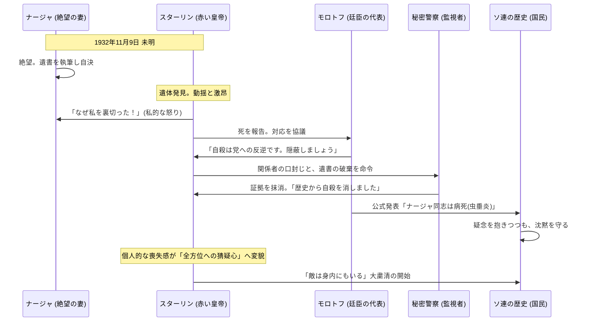

# 要約
​## 祝宴の虚飾
1932年、ナージャはベルリン仕立ての黒ドレスで着飾り、夫との冷え切った関係を隠して祝宴に臨んだ。
​## 閉鎖的ファミリー
クレムリンの権力者たちは、長年の友情と憎悪で結ばれた「ひとつの巨大な家族」として共同生活を送っていた。
​スターリンの二面性： 独裁者は「鋼鉄の男」として君臨する一方、私生活では粗野で女性への配慮を欠く傲慢な家長であった。
## ​ナージャの孤独と病
理想を追うナージャは、夫の政治的冷酷さと家庭内での無視に晒され、心身ともに限界を迎えていた。
​## 祝宴での衝突
スターリンが別の女性と戯れ、ナージャに吸殻を投げつけたことで、彼女の忍耐は公衆の面前で決壊した。
​## 絶望への散歩
席を立ったナージャは親友ポリーナと深夜の散歩をし、夫への不満を漏らすが、心はすでに死へと傾いていた。
​## 暗転する寝室
ナージャは自室で小型拳銃を手にし、夫への政治的・個人的告発を綴った手紙を残して自ら命を絶った。
​## 死の発見と衝撃
翌朝、遺体を発見したスターリンは、悲しみよりも先に「妻による裏切り」としての怒りに震えた。
​## 公式の隠蔽
自殺は「政治的敗北」と見なされ、党幹部たちは死因を「虫垂炎」と偽る沈黙の共謀を開始した。
​## テロルへの転換点
この個人的悲劇を機にスターリンの猜疑心は爆発し、ソ連は後に続く大粛清（大テロル）の時代へと舵を切った。

# シーケンス図

