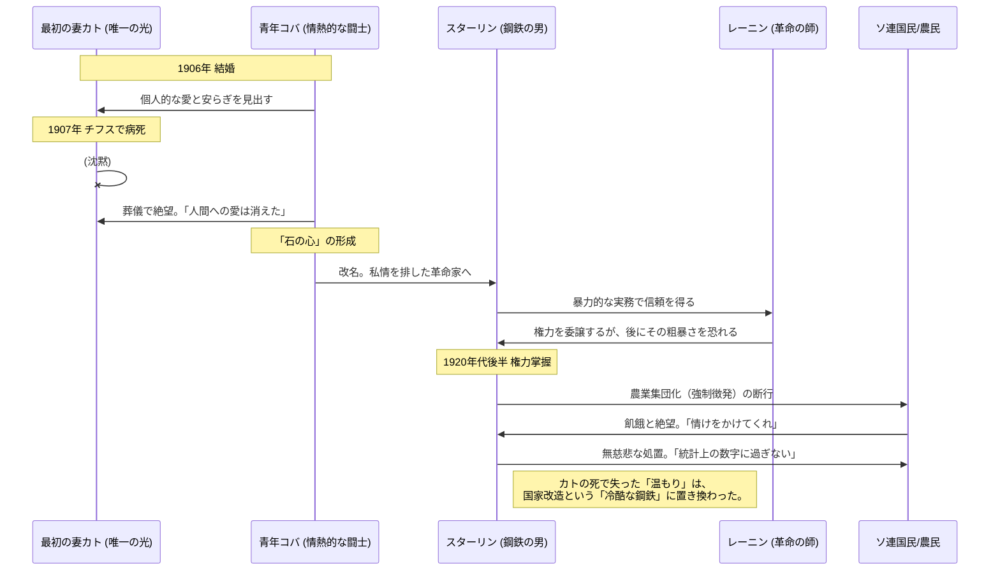

# 要約
​## 出自と過酷な少年時代
1878年、グルジアの貧しい靴屋の息子として生まれたヨシフ（コバ）は、父の暴力と母の過保護な教育の間で、冷酷さと知性を同時に育んだ。
​## 神学校での反逆
正教会の神学校に入学したコバは、抑圧的な教育体制に反発し、禁書を読み漁ることで無神論とマルクス主義に目覚めていった。
​## 職業的革命家への道
神学校を追放された後、地下活動に身を投じたコバは、銀行強盗や暗殺を厭わない過激な闘士として頭角を現した。
​## レーニンとの出会い
1905年、フィンランドの会議で生涯の師となるレーニンと出会い、その実務的な暴力性と冷徹な組織論に強い感銘を受けた。
​## 最初の妻カトとの純愛
革命活動の最中、敬虔で控えめな女性カト（エカチェリーナ・スワニゼ）と結婚し、彼女との短い生活の中で唯一の安らぎを得た。
​## ナージャ家との運命的接点
流刑と脱走を繰り返す中で、後に二人目の妻となる幼いナージャの一家（アリルジェワ家）とも深い絆を結んでいた。
​## カトの死と精神的決別
1907年、最愛の妻カトが病死した際、スターリンは「人間に対する最後の温かい感情も彼女と共に死んだ」と語り、心を完全に閉ざした。
​## 鋼鉄の男（スターリン）の誕生
カトの死後、彼は自らを「スターリン」と名乗り、個人的な幸福を捨てて、冷徹な革命の機械へと化していった。
​## 権力の階段とレーニンの不信
1917年の革命を経て党の要職に就くが、その強引な手法は晩年のレーニンにさえ「あまりに粗暴だ」と危惧されるようになった。
​## 集団化という名の戦争
政権掌握後、農民から穀物を強制徴発する「集団化」を強行し、数百万人の犠牲を厭わない独裁の基礎を確立した。

