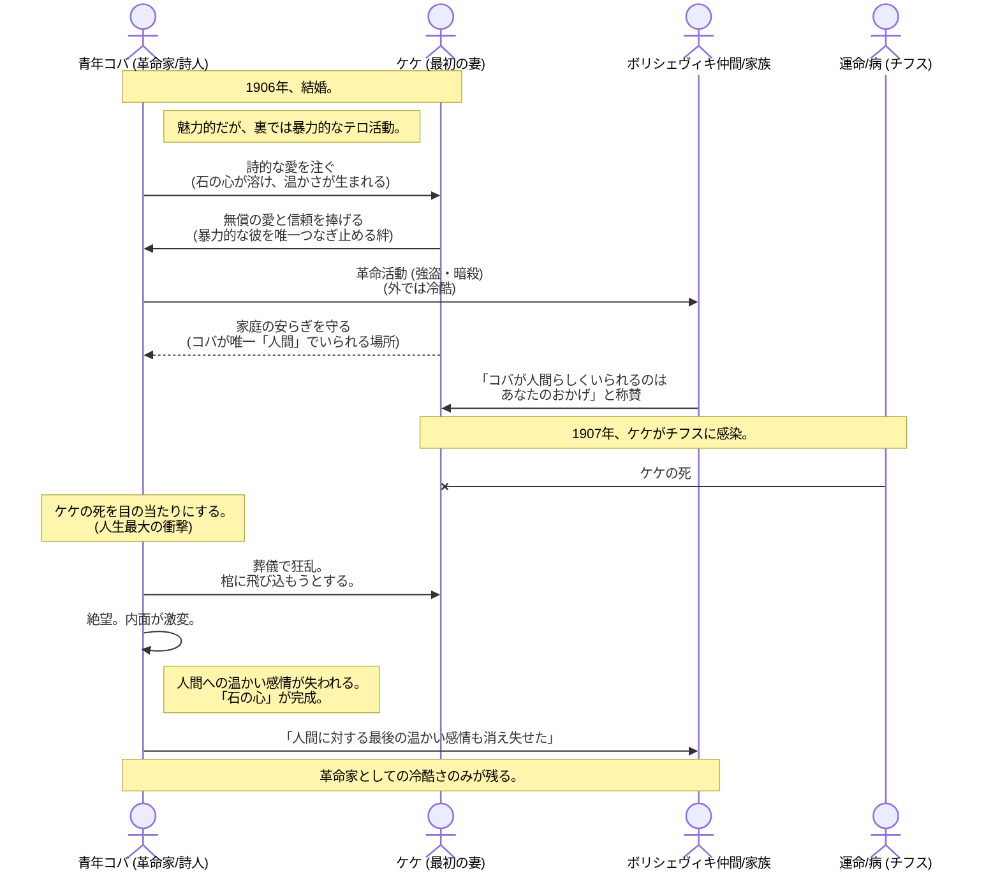

```mermaid
sequenceDiagram
    actor Koba as 青年コバ (革命家/詩人)
    actor Keke as ケケ (最初の妻)
    actor Bolsheviks as ボリシェヴィキ仲間/家族
    actor Death as 運命/病 (チフス)

    Note over Koba, Keke: 1906年、結婚。
    Note right of Koba: 魅力的だが、裏では暴力的なテロ活動。
    Koba->>Keke: 詩的な愛を注ぐ<br/>(石の心が溶け、温かさが生まれる)
    Keke->>Koba: 無償の愛と信頼を捧げる<br/>(暴力的な彼を唯一つなぎ止める絆)

    Koba->>Bolsheviks: 革命活動 (強盗・暗殺)<br/>(外では冷酷)
    Keke-->>Koba: 家庭の安らぎを守る<br/>(コバが唯一「人間」でいられる場所)

    Bolsheviks->>Keke: 「コバが人間らしくいられるのは<br/>あなたのおかげ」と称賛

    Note over Keke, Death: 1907年、ケケがチフスに感染。
    Death-X Keke: ケケの死

    Note over Koba: ケケの死を目の当たりにする。<br/>(人生最大の衝撃)
    Koba->>Keke: 葬儀で狂乱。<br/>棺に飛び込もうとする。
    Koba->>Koba: 絶望。内面が激変。
    
    Note right of Koba: 人間への温かい感情が失われる。<br/>「石の心」が完成。
    Koba->>Bolsheviks: 「人間に対する最後の温かい感情も消え失せた」

    Note over Koba, Bolsheviks: 革命家としての冷酷さのみが残る。

```

