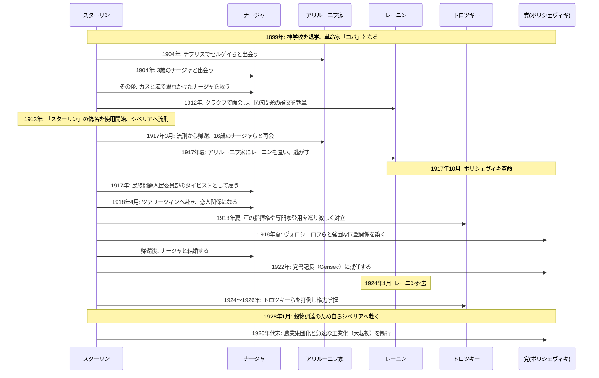

```mermaid
sequenceDiagram
    participant Stalin as スターリン
    participant Nadya as ナージャ
    participant Family as アリルーエフ家
    participant Lenin as レーニン
    participant Trotsky as トロツキー
    participant Party as 党(ボリシェヴィキ)

    Note over Stalin, Party: 1899年: 神学校を退学、革命家「コバ」となる
    Stalin->>Family: 1904年: チフリスでセルゲイらと出会う
    Stalin->>Nadya: 1904年: 3歳のナージャと出会う
    Stalin->>Nadya: その後: カスピ海で溺れかけたナージャを救う
    Stalin->>Lenin: 1912年: クラクフで面会し、民族問題の論文を執筆
    Note over Stalin: 1913年: 「スターリン」の偽名を使用開始、シベリアへ流刑
    Stalin->>Family: 1917年3月: 流刑から帰還、16歳のナージャらと再会
    Stalin->>Lenin: 1917年夏: アリルーエフ家にレーニンを匿い、逃がす
    Note over Lenin, Party: 1917年10月: ボリシェヴィキ革命
    Stalin->>Nadya: 1917年: 民族問題人民委員部のタイピストとして雇う
    Stalin->>Nadya: 1918年4月: ツァリーツィンへ赴き、恋人関係になる
    Stalin->>Trotsky: 1918年夏: 軍の指揮権や専門家登用を巡り激しく対立
    Stalin->>Party: 1918年夏: ヴォロシーロフらと強固な同盟関係を築く
    Stalin->>Nadya: 帰還後: ナージャと結婚する
    Stalin->>Party: 1922年: 党書記長（Gensec）に就任する
    Note over Lenin: 1924年1月: レーニン死去
    Stalin->>Trotsky: 1924〜1926年: トロツキーらを打倒し権力掌握
    Note over Stalin, Party: 1928年1月: 穀物調達のため自らシベリアへ赴く
    Stalin->>Party: 1920年代末: 農業集団化と急速な工業化（大転換）を断行
```

