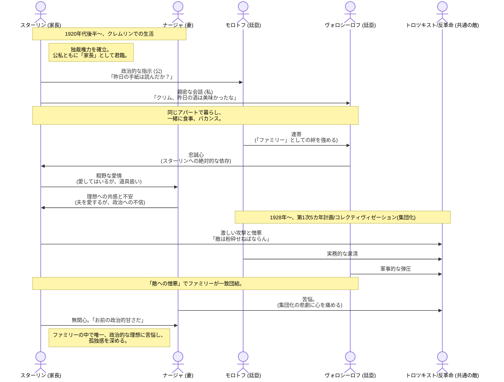

# ファミリーメンバー
​スターリン（ウサ）： ファミリーの「家長」。気さくな一面も見せるが、その裏に支配欲と冷酷さを秘めている。
​ナージャ： スターリンの妻。繊細で政治に理想を持つが、夫の独裁に苦悩する。
​モロトフ： スターリンの最も忠実な「筆頭廷臣」。冷徹な官僚。妻ポリーナもナージャの親友。
​ヴォロシーロフ（クリム）： スターリンの古い革命仲間。軍事の素人だが、スターリンへの忠誠心で出世した。
​オルジョニキゼ（セルゴ）： スターリンと同じグルジア出身。スターリンを「コバ」と呼べる数少ない親友だが、後にスターリンと対立していく。