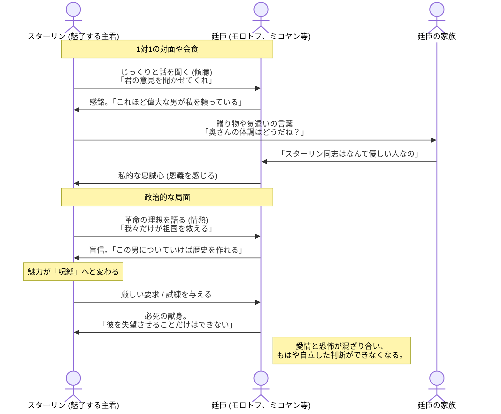

# 独裁者の「磁力」
この章のポイント：独裁者の「磁力」
​後の歴史を知る私たちは、スターリンを「氷のような独裁者」と考えがちですが、当時の廷臣たちにとって、彼は**「最高に魅力的で、親しみやすく、頼りがいのあるリーダー」**でした。
​## カメレオンのような適応力：
スターリンは相手に合わせて自分を演出する天才でした。粗野な労働者には「叩き上げの同志」として、知識人には「該博な知識を持つ読書家」として、そして部下には「面倒見の良い父親（ヴォズジ）」として振る舞いました。
​## 細やかな気配りと「個人的な絆」：
彼は部下の家族の健康状態や子供の名前を驚くほどよく覚えていました。ちょっとした手紙や電話、贈り物で「自分は最高指導者に特別に目をかけられている」と錯覚させる術に長けていました。これが廷臣たちの「盲目的な忠誠心」を生みました。
​## 「謙虚さ」という武器：
豪華な生活を嫌い（表向きは）、質素な軍服を着て、タバコを燻らせながらじっくりと相手の話を聞く。この「控えめな指導者」像が、かえって彼の巨大な権威を際立たせました。
​死をも辞さない献身の要求：
彼は自分を「革命の道具」として定義していました。廷臣たちにも同様の献身を求め、彼らもまた、スターリンの魅力に毒され、彼に認められるためなら友人を売ることも厭わなくなっていきました。
