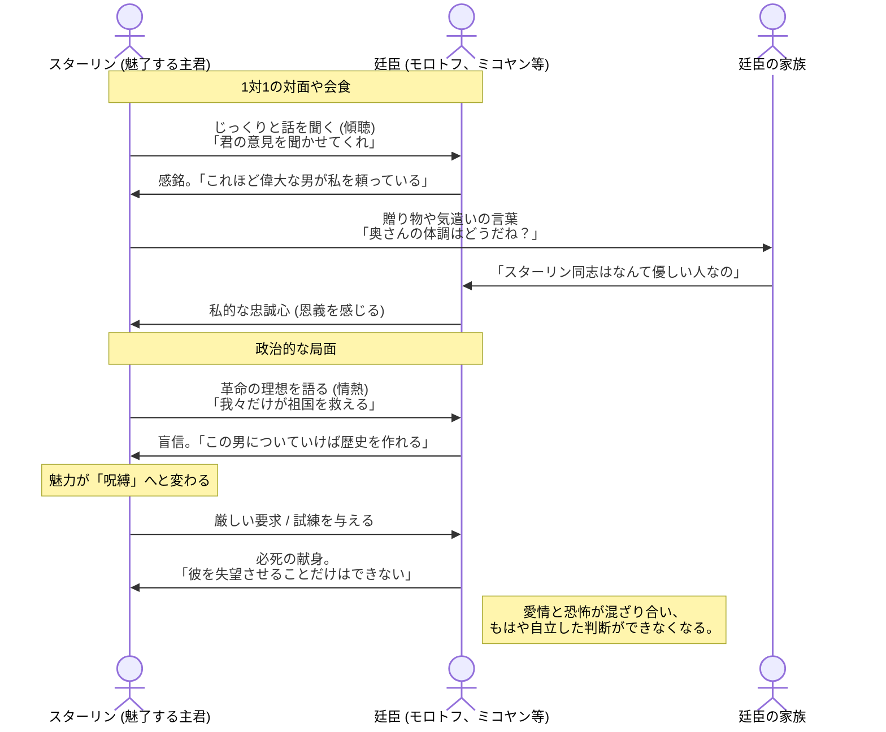

```mermaid
sequenceDiagram
    actor Stalin as スターリン (魅了する主君)
    actor Courtier as 廷臣 (モロトフ、ミコヤン等)
    actor Family as 廷臣の家族

    Note over Stalin, Courtier: 1対1の対面や会食
    
    Stalin->>Courtier: じっくりと話を聞く (傾聴)<br/>「君の意見を聞かせてくれ」
    Courtier->>Stalin: 感銘。「これほど偉大な男が私を頼っている」
    
    Stalin->>Family: 贈り物や気遣いの言葉<br/>「奥さんの体調はどうだね？」
    Family->>Courtier: 「スターリン同志はなんて優しい人なの」
    Courtier->>Stalin: 私的な忠誠心 (恩義を感じる)

    Note over Stalin, Courtier: 政治的な局面
    Stalin->>Courtier: 革命の理想を語る (情熱)<br/>「我々だけが祖国を救える」
    Courtier->>Stalin: 盲信。「この男についていけば歴史を作れる」

    Note over Stalin: 魅力が「呪縛」へと変わる
    Stalin->>Courtier: 厳しい要求 / 試練を与える
    Courtier->>Stalin: 必死の献身。<br/>「彼を失望させることだけはできない」
    
    Note right of Courtier: 愛情と恐怖が混ざり合い、<br/>もはや自立した判断ができなくなる。

```

