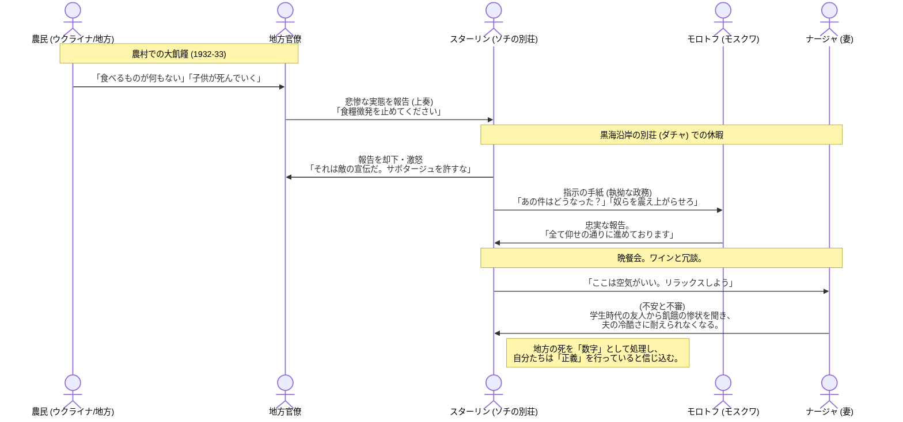

# 断絶された二つの現実
​モンテフィオーリは、あえて凄惨な飢餓の報告と、スターリンたちの和やかな休暇の描写を並置することで、独裁体制の不条理を浮き彫りにします。
​## 地獄の農村：
強引な農業集団化（コレクティヴィゼーション）により、ウクライナやカザフスタンで未曾有の飢饉が発生。カニバリズム（共食い）の報告さえクレムリンに届いていましたが、スターリンはこれを「階級敵のサボタージュ」と断じ、食糧徴発の手を緩めませんでした。
​## 別荘（ダチャ）の楽園：
一方、スターリン一家と廷臣たちは、黒海沿岸のソチなどで長い夏休みを過ごします。そこではボウリングをし、蓄音機で音楽を流し、自家製のワインを飲み、冗談を言い合う「幸せな大家族」の姿がありました。
​## 「最高指導者」のワーカホリックな休日：
休暇中もスターリンは大量の書類に目を通し、モスクワのモロトフへ細かな指示を書き送ります。彼は自分が「国家のために身を粉にして働いている」という自己陶酔の中にあり、その書類の先にある数百万の死を、単なる「統計上の数字」として処理していました。
