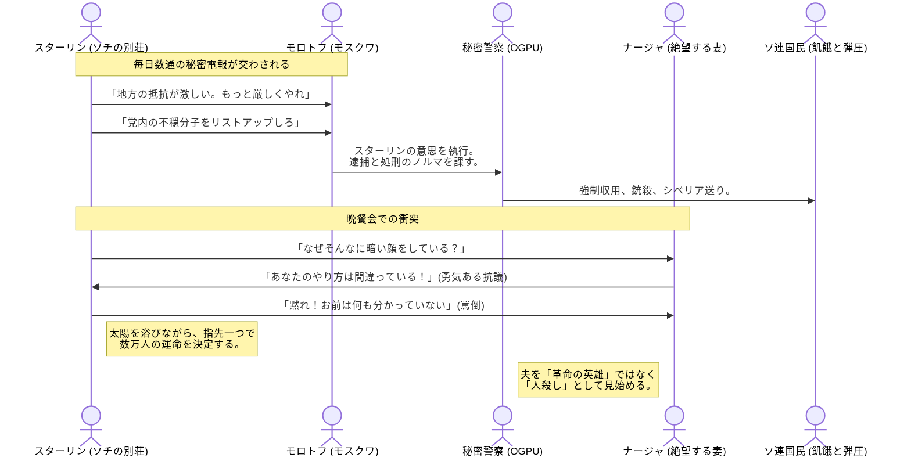

# 別荘が「処刑指令室」に変わる時
​モンテフィオーリは、美しい海辺の風景と、そこで交わされる血生臭い電報の対比を執拗に描き出します。
​## 「海辺の政治局」：
最高指導部（政治局員）の多くがスターリンと共に南部に滞在していました。公式の会議室ではなく、夕食のテーブルや散歩の途中で国家の重大な方針が決定されます。リラックスした雰囲気の中で、「誰を処刑し、誰を追放するか」が冗談混じりに話し合われました。
​## モロトフへの「遠隔操作」：
モスクワに留守番として残されたモロトフに対し、スターリンは毎日大量の電報（指令）を送ります。そこには「抵抗する者は情け容赦なく根絶やしにせよ」といった、大飢饉の犠牲者をさらに増やすような指示が並んでいました。
​## ナージャの限界：
スターリンの妻ナージャは、この「休暇」の裏側にある残酷さを直視してしまいます。彼女は大学に通い、一般市民の窮状を耳にしていました。夫の「鋼鉄の意志」が、単なる「無慈悲な虐殺」に見え始め、二人の間の口論は絶望的なものになっていきます。

# 電報の中の「情熱」
​この時期のスターリンの電報は、政治的な指示だけでなく、モロトフに対する「兄貴分」としての親密さや、時には細かな嫌がらせ、執拗な確認作業に満ちています。モンテフィオーリはこれを「独裁者の愛の形」として描き、その歪んだ親密さが、後の粛清で「裏切り」に変わる瞬間の恐怖を予感させます。