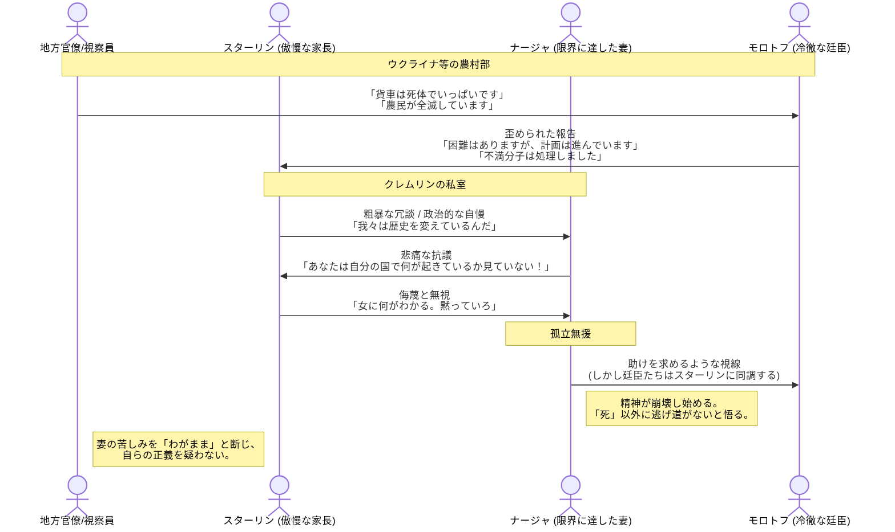

# 公私の「破綻」が重なる時
​モンテフィオーリは、スターリンが国家を改造しようとする「鋼鉄の意志」が、最も身近な存在である妻ナージャをいかに破壊していったかを克腕で描きます。
​## 地獄からの報告：
モロトフやカガノーヴィチら「廷臣」たちは、地方を視察し、死体で溢れる貨車や駅の惨状を目撃します。しかし、彼らはスターリンへの忠誠心から、それを「必要な犠牲」あるいは「敵の抵抗」として正当化し、真実を歪めて報告し続けました。
​## ナージャの神経症：
ナージャは、夫が「偉大な建設者」ではなく「大量虐殺者」であるという現実に耐えられなくなります。彼女は激しい頭痛と神経衰弱に悩まされ、スターリンの粗野な振る舞いや、自分を無視して廷臣たちと「死の政治」に興じる姿に絶望を深めていきます。
​## 「愛」という名の支配：
スターリンは彼女を愛してはいましたが、それは所有物としての愛でした。彼女が政治に口を出すことを嫌い、自分の「正しさ」を疑うことを許しませんでした。この「愛の不在」ではなく「愛の歪み」が、ナージャを袋小路に追い詰めます。
# 独裁者の「盲目」
​この章で最も恐ろしいのは、スターリンが「自分が悪である」と思っているのではなく、「自分こそが唯一の正義であり、ナージャの苦悩は理解不足による裏切りである」と考えていた点です。この独善的な愛が、1932年のあの運命の夜（ナージャの自殺）へのカウントダウンを早めていきます。