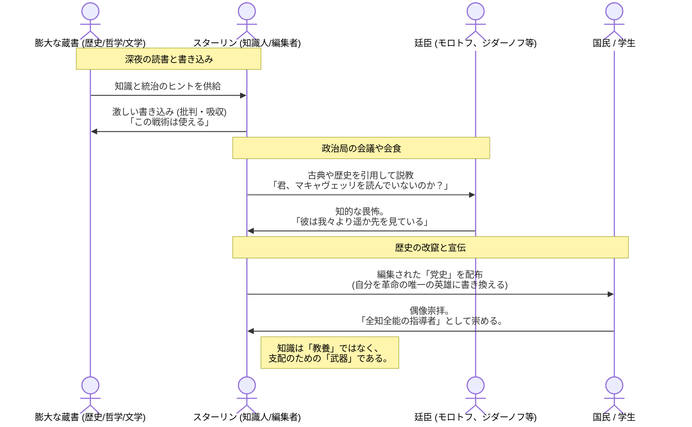

# 書斎という名の「戦場」
​モンテフィオーリは、スターリンがペンを握り、膨大な蔵書に書き込みをする姿を通じて、彼の「内面世界」を解剖します。
​## 驚異的な読書量：
スターリンの蔵書は2万冊を超え、マルクス主義の理論書だけでなく、ドストエフスキー、チェーホフ、シェイクスピア、さらにはビスマルクの回想録まで網羅していました。彼は1日に500ページ以上読むこともあり、本の内容を驚異的な記憶力で保持していました。
​余白への書き込み（マルギナリア）：
彼は本を読みながら、余白に「ハハ！」「クズめ！」「重要だ」といった激しい言葉を書き込みました。彼にとって読書は著者との対話であり、同時に「敵」を見極め、「統治の術」を盗むための軍事演習でもありました。
​## 歴史を「演出」する編集者：
彼は自ら歴史教科書の執筆・編集に関わり、自分に都合の良いように事実を書き換えました。言葉の持つ力を知り尽くしており、スローガン一つで数百万人の心を操り、あるいは数万人を死に追いやる「言葉の魔術師」でもありました。
​## 「哲学する王」への自負：
彼は自分を、プラトンが提唱した「哲人王」のソ連版であると信じていました。廷臣たちに対して、自分がいかに博識であるかを見せつけることで、彼らに「この男には敵わない」という知的劣等感を植え付け、支配を強固にしました。
# イワン雷帝への傾倒
​この章では、スターリンがロシア史上屈指の暴君、**イワン雷帝（イヴァン4世）**の伝記を愛読し、彼の残虐行為を「国家統一のための必然」として正当化していたエピソードが語られます。彼は歴史上の暴君に自分を重ね合わせることで、自らの血塗られた決断を「歴史的使命」へと昇華させていたのです。