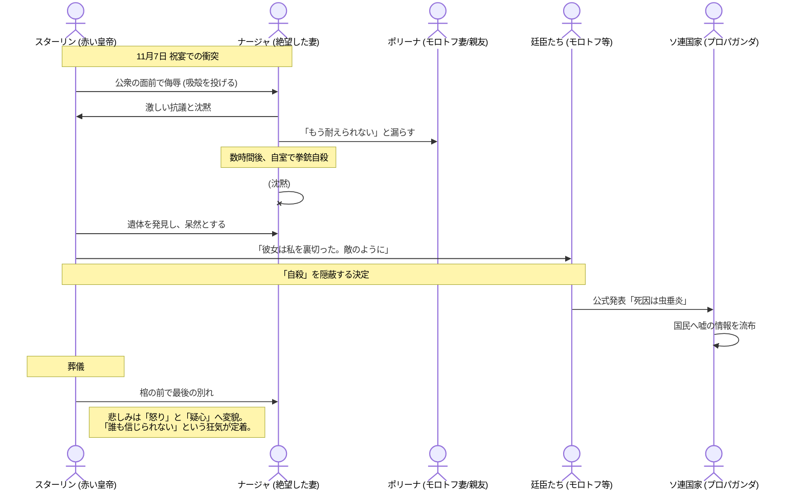

# 愛の終焉と「猜疑心」の爆発
​1932年11月、妻ナージャの自殺。これは単なる家庭の悲劇に留まらず、スターリンという男から「最後のブレーキ」を取り払い、ソ連を大粛清へと向かわせる転換点となりました。
​## 運命の夜：
革命記念日の祝宴で、スターリンが他の女性（ガルカ・エゴロワ）と親しげにし、ナージャにタバコの吸殻を投げつけるなどの無礼な振る舞いをしたことが引き金となりました。ナージャは席を立ち、その夜、自ら命を絶ちました。
​スターリンの衝撃と怒り：
スターリンは悲しみに暮れる一方で、ナージャの死を「自分に対する裏切り」と受け取りました。「なぜ彼女は私を捨てたのか？」「彼女も敵の一人だったのか？」という問いが、彼の猜疑心を極限まで高めます。
​## 公式の嘘：
死因は「虫垂炎」と発表されました。自殺という事実は隠蔽され、この「嘘」を共有することがファミリー（廷臣たち）に課せられた最初の大きな「沈黙の踏み絵」となりました。
​## 「人間」の死：
葬儀の日、スターリンは棺の後に続いて歩きましたが、途中で立ち止まり、車に乗り込みました。モンテフィオーリは、この時スターリンの中の「人間的な部分」が完全に埋葬されたと描写しています。