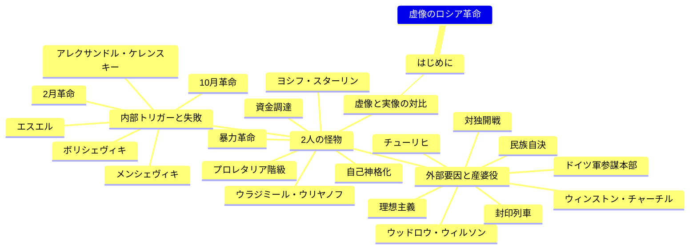

```mermaid
mindmap
    虚像のロシア革命
       はじめに
           虚像と実像の対比
               2人の怪物
                   ウラジミール・ウリヤノフ
                   ヨシフ・スターリン
                   プロレタリア階級
                   暴力革命
                   資金調達
                   自己神格化
                外部要因と産婆役
                    ウッドロウ・ウィルソン
                    理想主義
                    民族自決
                    ウィンストン・チャーチル
                    対独開戦
                    ドイツ軍参謀本部
                    封印列車
                    チューリヒ
                内部トリガーと失敗
                    アレクサンドル・ケレンスキー
                    2月革命
                    10月革命
                    ボリシェヴィキ
                    メンシェヴィキ
                    エスエル
                    
```
