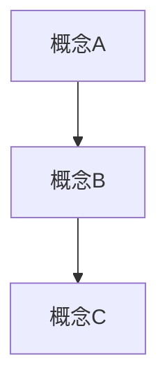

# 書誌情報

- 書名:虚像のロシア革命 後付け理論で繕った唯物史観の正体
- 著者:渡辺惣樹
- 出版年:2023
- 章:1
- ページ:

---

# 本書の中心テーマ（仮）

> 本書は何を説明しようとしているか

- 

---

# 重要断片メモ（KJカード）

※ **1行 = 1主張**

形式

- [役割] 内容 (p.xx)

役割タグ

- 主張
- 前提
- 因果
- 効果
- 例
- 対立
- 疑問
- 自分

---

- [] 

- [] 

- [] 

- [] 

---

# 仮グルーピング（KJ法）

※ ここは後でAIが整理する

## グループA

- 

## グループB

- 

## グループC

- 

---

# 構造仮説（論理構造）

- 中心命題:
- 前提:
- メカニズム:
- 帰結:
- 反論:

---

# Mermaid構造図

