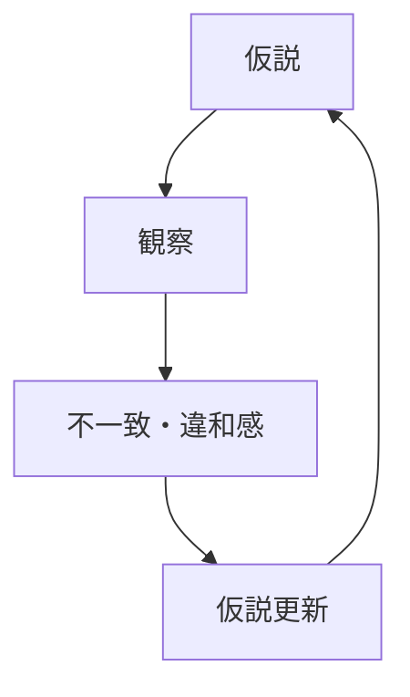

# 仮説ころがし（Hypothesis Rolling）

---
is_a:
  - concept
related_to:
  - 探索
  - 学習
  - フィードバック
  - 不確実性処理

part_of:
  - Thinking Engine
  - Research Loop

instance_of:
  - 探索的思考プロセス

causes:
  - 仮説更新
  - 理解深化
  - パターン発見

caused_by:
  - 観察
  - 違和感
  - 情報不足

mechanism:
  - Belief Update Mechanism
  - Learning Mechanism
  - Selection Mechanism

structure:
  - ループ構造
  - 逐次更新構造

status: draft
---

## 定義

仮説ころがしとは、仮説を固定せず、観察や情報との相互作用によって連続的に更新・変形・破棄しながら進む探索的思考プロセスである。

仮説は検証対象ではなく、探索を前進させるための一時的な足場として扱われる。

---

## コア特性

### 1. 非固定性（Non-fixity）
仮説は前提ではなく暫定状態であり、常に変更される。

---

### 2. 逐次更新（Iterative Update）
観察結果に応じて仮説が連続的に変形する。

---

### 3. 違和感駆動（Mismatch-driven）
更新は論理ではなく「違和感」や「ズレ」によってトリガーされる。

---

### 4. 消耗品性（Disposable Hypothesis）
仮説は正しさよりも有用性で評価され、不要になれば破棄される。

---

## 構造

この構造は閉じた検証ではなく、開いた探索ループである。

---

# 仮説検証との違い
|項目|仮説検証|仮説ころがし|
|---|---|---|
|仮説|固定|可変|
|目的|正誤判定|探索前進|
|終了|判定で終了|継続|
|プロセス|線形|ループ|

---
# 発動条件
- 不確実性が高い
- 問題構造が未定義
- 現地観察が可能
- 完全情報が得られない
- 適用領域

---

# 適用領域
- フィールドワーク
- 都市・観光分析
- 研究初期段階
- 事業仮説構築
- デザイン思考

---

# 失敗パターン
- 仮説固着
最初の仮説に執着し更新しない
- 仮説不在
仮説を持たず観察のみ行う
- 更新停止
違和感を無視する

---

# 関連概念
[[探索]]（Exploration）
[[02_zettelkasten/Zettelkasten Engine/01_knowledge/world_model/meta/model/social/information/学習|学習]]（Learning）
[[フィードバック]]（Feedback）
[[02_zettelkasten/Zettelkasten Engine/01_knowledge/world_model/meta/model/social/economy/経路依存|経路依存]]
[[02_zettelkasten/Zettelkasten Engine/01_knowledge/world_model/meta/model/system/dynamic/ロックイン|ロックイン]]

---

## メモ
仮説ころがしは「正しい理解を得る手法」ではなく、
「理解に到達するための運動そのもの」である。