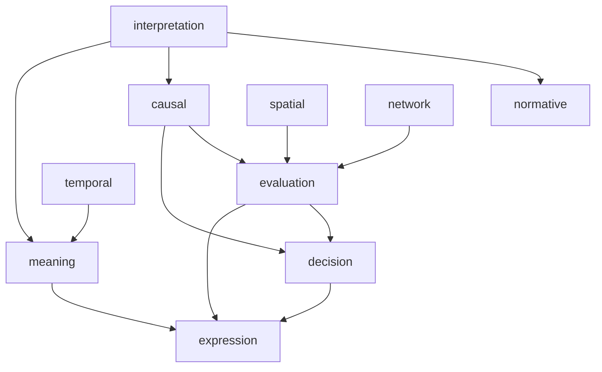

# 依存グラフ

---
# 図の読み方
### 中核フロー

読む → 理解 → 評価 → 判断 → 表現
### 具体：
- IP → CS → EL → DS → EX
- IP → MN → EX
## 核となる3本柱

### ① 因果ライン

CS → EL → DS  
（理解 → 評価 → 意思決定）

### ② 意味ライン

MN → EX  
（解釈 → 表現）

### ③ 構造ライン

SP / NW → EL  
（構造 → 評価）

---

# Engineチェックリスト

各Engineを「人力LLM化」するための操作手順。

## 1 Interpretation
#