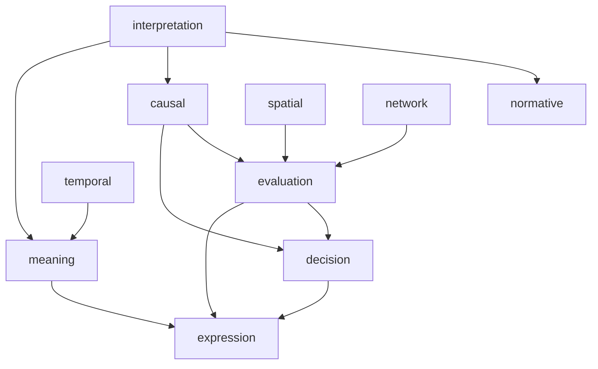

# 依存グラフ

---
# 図の読み方
### 中核フロー

読む → 理解 → 評価 → 判断 → 表現
### 具体：
- IP → CS → EL → DS → EX
- IP → MN → EX
## 核となる3本柱

### ① 因果ライン

CS → EL → DS  
（理解 → 評価 → 意思決定）

### ② 意味ライン

MN → EX  
（解釈 → 表現）

### ③ 構造ライン

SP / NW → EL  
（構造 → 評価）

---

# Engineチェックリスト

各Engineを「人力LLM化」するための操作手順。

##  Interpretation Checklist
[[Interpretation Engine]]

- 主張は何か？
- 何を説明しているか？
- 前提は何か？
- どの文が重要か？
- 曖昧な語は何か？

## Causal Checklist  
  
- 何が起きたか？  
- その前に何があったか？  
- 必要条件は？  
- トリガーは？  
- フィードバックはあるか？  
- 他の説明は可能か？

## Normative Checklist  
  
- ルールは何か？  
- 要件は何か？  
- 例外はあるか？  
- 解釈の余地は？  
- 適用できるか？

## Decision Checklist  
  
- 選択肢は何か？  
- 評価軸は何か？  
- 最悪ケースは？  
- リスクは？  
- 長期と短期の違いは？
- 
## Evaluation Checklist  
  
- 何を評価するか？  
- 基準は何か？  
- 比較対象は？  
- 重みは？  
- 主観と客観の差は？

## Meaning Checklist  
  
- 何が象徴的か？  
- 対立は何か？  
- 何が変化したか？  
- 何を伝えたいか？  
- なぜ重要か？

## Spatial Checklist  
  
- 点・線・面は？  
- 集中か分散か？  
- 動線はどうなっているか？  
- 境界はどこか？  
- ボトルネックは？

## Network Checklist  
  
- ノードは？  
- ハブは？  
- 接続密度は？  
- 冗長性は？  
- 単一点故障は？

## Temporal Checklist  
  
- 区切りは？  
- 山と谷は？  
- 繰り返しは？  
- 変化点は？  
- 全体の流れは？

## Expression Checklist  
  
- 何を伝えたいか？  
- 強調はどこか？  
- 構図は？  
- 省略すべきものは？  
- ノイズは何か？