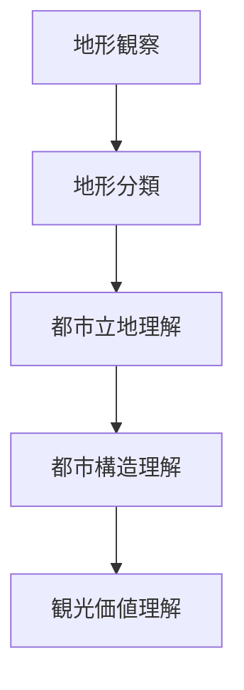
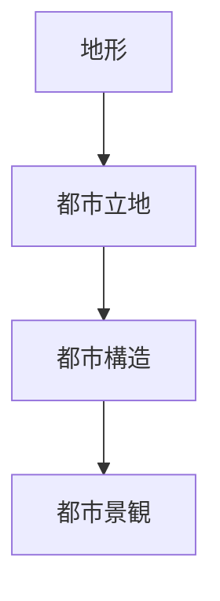

# 地形解釈

## 概要

地形解釈とは  
**地形から都市や集落の成立条件・空間構造を読み取る行為**である。

都市や集落の多くは次の要因で成立する。

- 防御
- 水資源
- 交通
- 農業

これらはすべて **地形条件**に強く依存する。

そのためフィールドワークでは

**最初に地形を見る**

ことが重要である。

---

## 地形解釈の基本プロセス

---

## 都市と地形

都市は主に次の地形に成立する。

### 台地

特徴

- 洪水に強い
- 防御性が高い
- 見晴らしが良い

都市例

- 東京（武蔵野台地）
- 奈良

---

### 河岸段丘

特徴

- 洪水を避けられる
- 水利用が可能

都市例

- 金沢
- 京都

---

### 扇状地

特徴

- 水資源
- 農業適地

都市例

- 甲府
- 松本

---

### 自然堤防

特徴

- 洪水に比較的強い
- 河川交通

都市例

- 江戸（東京）

---

### 谷

特徴

- 水資源
- 防御

都市例

- 鎌倉

---

## 地形と都市構造

都市構造は地形によって決まる。

例

地形

河岸段丘

↓

都市立地

城

↓

都市構造

城下町

↓

景観

武家屋敷・寺町

---

## 地形観察のポイント

フィールドワークでは次を観察する。

### 高低差

- 台地
- 段丘
- 崖

---

### 水系

- 河川
- 湧水
- 海岸

---

### 交通

- 谷筋
- 平地
- 峠

---

### 防御

- 崖
- 山
- 河川

---

## 例

### 金沢

地形

- 卯辰山
- 小立野台地
- 浅野川
- 犀川

構造

河岸段丘都市

都市構造

- 城
- 武家地
- 寺町
- 町人地

---

## フィールドワークでの使い方

現地では次の順序で見る。

1 山を見る  
2 川を見る  
3 高低差を見る  
4 都市配置を見る  

これにより

**都市成立の理由**

が理解できる。

---

## 地形解釈の目的

地形解釈の目的は次である。

- 都市成立条件理解
- 都市構造理解
- 歴史理解
- 観光価値発見

---

## 関連ノート

- [[02_zettelkasten/21_domain/fieldwork_tourism/01_concept/フィールドワーク観察]]
- [[景観読解]]
- [[河岸段丘]]
- [[台地都市]]
- [[都市レイヤー]]