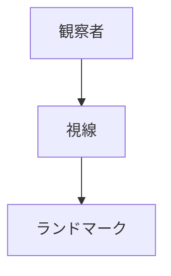

# 象徴（ランドマーク）

## 概要

象徴とは  
**都市の中で目印となる対象**である。

都市では

- 建築
- 山
- タワー
- 神社

などが都市の象徴となる。

Kevin Lynch の理論では  
**landmark** と呼ばれる。

---

# 象徴の基本構造

象徴は  
**都市空間を認識する基準点**である。

---

# 象徴の種類

## 建築ランドマーク

例

- 城
- タワー
- 大聖堂

特徴

都市象徴。

---

## 自然ランドマーク

例

- 山
- 海
- 大河

特徴

自然地形。

---

## 宗教ランドマーク

例

- 神社
- 寺院
- 教会

特徴

宗教象徴。

---

## 現代ランドマーク

例

- 高層ビル
- 観光施設

特徴

都市イメージ。

---

# 象徴の役割

象徴は都市に

- 方向認識
- 都市イメージ
- 観光資源

を与える。

---

# フィールドワーク質問

1 この都市の象徴は何か  
2 遠くから見えるものは何か  
3 視線はどこへ導かれるか  
4 観光写真の対象は何か  

---

# 観察ポイント

- 城
- 山
- タワー
- 神社

---

# 例

## 城下町

象徴

城

特徴

政治中心。

---

## 港町

象徴

灯台

特徴

航海目印。

---

## 観光都市

象徴

タワー

特徴

観光シンボル。

---

# Kevin Lynch 理論

| Lynch | 空間概念 |
|---|---|
| landmark | 象徴 |

---

# 関連ノート

- [[ランドマーク分析]]
- [[視線軸観察]]
- [[都市イメージ分析]]
- [[02_zettelkasten/21_domain/fieldwork_tourism/04_method/07_observation/05_urban_observation/都市観察チェックリスト]]