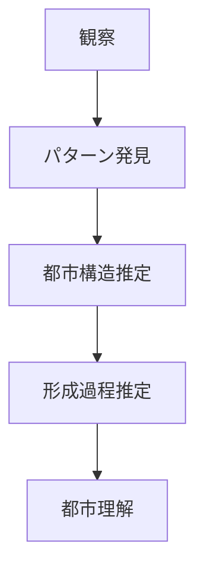
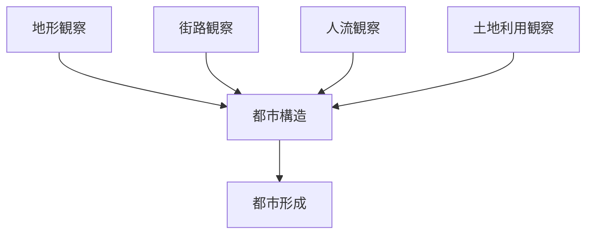

# 観察 → 都市構造推定フレーム

## 概要

観察 → 都市構造推定フレームとは  
**現地観察から都市の構造や形成過程を推定する方法**である。

都市研究では

- 地形
- 街路
- 人流
- 土地利用

などの観察から  
**都市の構造を推定する。**

---

# 基本構造

---

# Step1 観察

まず都市を観察する。

観察対象

- 地形
- 河川
- 道路
- 街区
- 人流
- 商業

関連ノート

- [[02_zettelkasten/21_domain/fieldwork_tourism/04_method/07_observation/05_urban_observation/都市観察チェックリスト]]

---

# Step2 パターン発見

観察から  
**都市のパターンを発見する。**

例

- 道路が放射状
- 川沿いに都市
- 駅前に商業集中

---

# Step3 都市構造推定

パターンから  
都市構造を推定する。

例

観察

- 駅前に商業
- 人流集中

推定

駅中心都市

---

# Step4 都市形成推定

都市構造から  
都市の形成過程を推定する。

例

駅中心都市

↓

鉄道開発都市

---

# 推論例

## 観察

- 川沿いに町
- 橋の近くに商業

## 推定

河岸都市

---

## 観察

- 放射道路
- 中央に城

## 推定

城下町

---

## 観察

- 駅前商業
- 放射道路

## 推定

鉄道都市

---

# 推論フロー

---

# フィールドワーク質問

1 都市の中心はどこか  
2 都市の軸はどこか  
3 商業はどこに集中しているか  
4 都市はどう形成されたか  

---

# 分析の目的

このフレームの目的は

- 都市構造理解
- 都市形成理解
- 観光空間理解

である。

---

# 関連ノート

- [[02_zettelkasten/21_domain/fieldwork_tourism/04_method/07_observation/05_urban_observation/都市観察チェックリスト]]
- [[街区分析]]
- [[都市軸分析]]
- [[土地利用分析]]
- [[都市形成プロセス分析]]