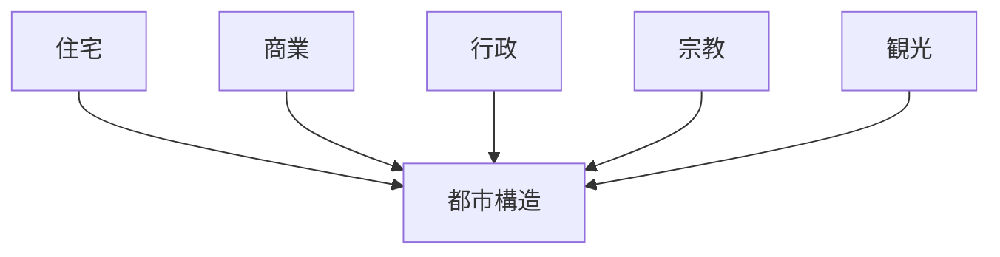
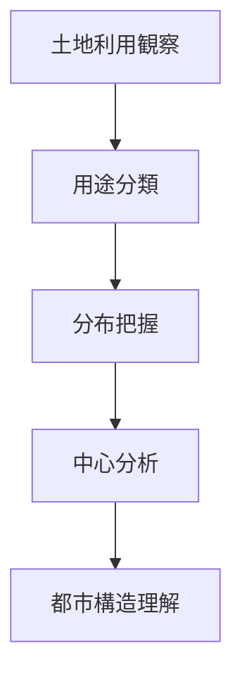

# 土地利用分析

## 概要

土地利用分析とは  
**都市や地域における土地の用途分布を分析する方法**である。

土地利用を分析することで

- 都市機能
- 都市構造
- 活動中心
- 観光構造

を理解できる。

---

# 土地利用の基本構造

---

# 主な土地利用

## 住宅

特徴

- 居住空間
- 生活活動

観察ポイント

- 住宅密度
- 住宅タイプ

---

## 商業

特徴

- 商店
- 飲食

観察ポイント

- 商業集積
- 商業中心

---

## 行政

特徴

- 官庁
- 公共施設

観察ポイント

- 行政中心

---

## 宗教

特徴

- 神社
- 寺院

観察ポイント

- 宗教地区

---

## 観光

特徴

- 観光施設
- 観光商業

観察ポイント

- 観光集中

---

# 土地利用パターン

代表的な都市パターン。

### 中心商業型

特徴

- 中心に商業

例

- 多くの都市中心

---

### 観光型

特徴

- 観光地集中

例

- 京都
- 鎌倉

---

### 住宅型

特徴

- 住宅中心

例

- 郊外都市

---

# 土地利用分析の手順

---

# フィールドワークでの質問

土地利用を見るときは次を考える。

1 商業はどこにあるか  
2 住宅はどこにあるか  
3 行政はどこにあるか  
4 観光施設はどこにあるか  

---

# 例

### 京都

商業

- 河原町

住宅

- 市街地周辺

宗教

- 寺院

観光

- 清水寺
- 嵐山

---

### 金沢

商業

- 近江町市場

住宅

- 武家地
- 町人地

宗教

- 寺町

観光

- 兼六園
- 茶屋街

---

# 分析の目的

土地利用分析の目的は以下である。

- 都市構造理解  
- 都市機能理解  
- 観光構造理解  

---

# 関連ノート

- [[都市構造分析フレーム]]
- [[都市レイヤー]]
- [[02_zettelkasten/21_domain/fieldwork_tourism/04_method/07_observation/05_urban_observation/都市観察チェックリスト]]
- [[商業観察チェックリスト]]