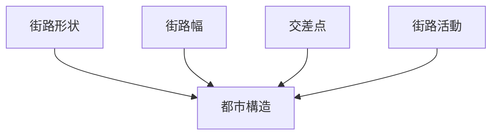
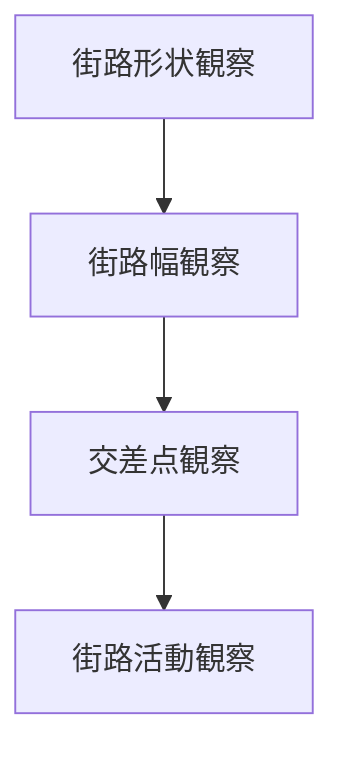

# 街路観察チェックリスト

## 概要

街路観察チェックリストとは  
**都市の街路構造を観察する際に確認すべき要素を整理したチェックリスト**である。

街路は

- 都市形成
- 都市計画
- 都市機能
- 人間活動

を反映する重要な要素である。

そのため街路を観察することで

- 都市の歴史
- 都市構造
- 都市機能

を理解することができる。

---

## 街路観察の基本構造

---

## 1 街路形状

街路の形を観察する。

観察項目

- 直線道路
- 曲線道路
- 放射道路

確認するポイント

- 計画都市
- 自然発生都市

---

## 2 街路幅

道路の幅を観察する。

観察項目

- 幹線道路
- 生活道路
- 歩行者道路

確認するポイント

- 交通量
- 都市機能

---

## 3 交差点

道路の交差点を観察する。

観察項目

- 十字路
- T字路
- 広場型交差点

確認するポイント

- 交通構造
- 都市中心

---

## 4 街路活動

街路で行われる活動を観察する。

観察項目

- 商業
- 歩行
- 観光

確認するポイント

- 人の流れ
- 活動の集中

---

## 街路パターン

代表的な街路構造。

### 碁盤目

特徴

- 計画都市
- 規則的

例

- 京都

---

### 放射型

特徴

- 中心都市

例

- パリ

---

### 曲線型

特徴

- 自然発生都市

例

- 城下町

---

## 街路観察の順序

---

## フィールドワークでの質問

街路を見るときは次を考える。

1 街路は直線か曲線か  
2 街路の幅はどうか  
3 交差点はどうなっているか  
4 人はどう動いているか  

---

## 例

### 京都

街路形状

- 碁盤目

街路幅

- 中規模道路

交差点

- 十字路

街路活動

- 商業
- 観光

---

### 金沢

街路形状

- 曲線街路

街路幅

- 狭い街路

交差点

- 複雑

街路活動

- 観光
- 商業

---

## 街路観察の目的

このチェックリストの目的は以下である。

- 都市構造理解  
- 都市形成理解  
- 都市機能理解  

---

## 関連ノート

- [[02_zettelkasten/21_domain/fieldwork_tourism/04_method/07_observation/05_urban_observation/都市観察チェックリスト]]
- [[景観読解]]
- [[都市構造分析フレーム]]
- [[町読みフレーム]]