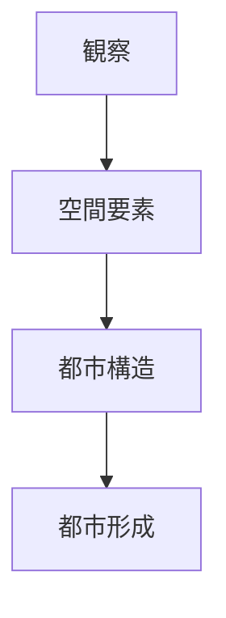
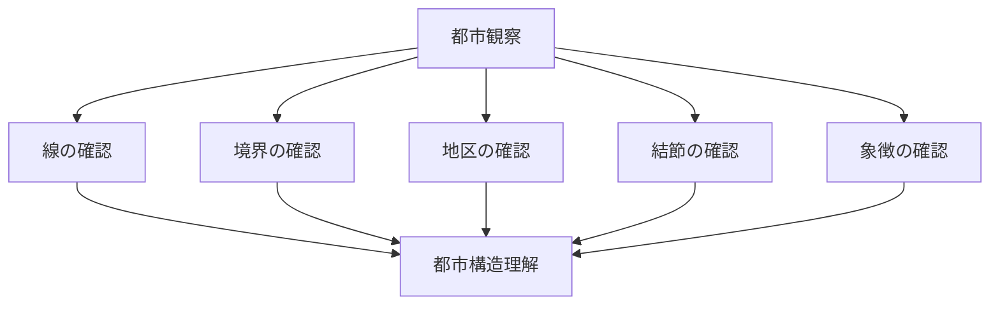

# 都市構造分析

## 概要

都市構造分析とは  
**都市の空間構造を観察と概念を使って理解する方法**である。

都市は

- 線
- 境界
- 面
- 結節
- 象徴

という空間要素で構成される。

これらを観察すると  
都市の構造と形成過程を理解できる。

---

# 分析フレーム

---

# 都市空間要素

都市構造は以下の要素で構成される。

- [[線（都市軸）]]
- [[境界（都市エッジ）]]
- [[面（都市地区）]]
- [[結節（都市ノード）]]
- [[象徴（ランドマーク）]]

---

# 観察との対応

| 空間要素 | 観察ノート |
|---|---|
| 線 | [[都市軸分析]] |
| 境界 | [[境界観察]] |
| 面 | [[土地利用分析]] |
| 結節 | [[公共空間観察]] |
| 象徴 | [[ランドマーク分析]] |

---

# 分析手順

---

# フィールドワーク質問

1 都市の軸はどこか  
2 都市はどこで区切られるか  
3 都市地区はどう分布するか  
4 人はどこに集まるか  
5 都市の象徴は何か  

---

# 分析の目的

都市構造分析の目的は

- 都市構造理解
- 都市形成理解
- 観光空間理解

である。

---

# 関連ノート

- [[02_zettelkasten/21_domain/fieldwork_tourism/04_method/07_observation/05_urban_observation/都市観察チェックリスト]]
- [[都市イメージ要素]]
- [[都市軸分析]]
- [[土地利用分析]]
- [[人流観察]]
- [[都市形成プロセス分析]]