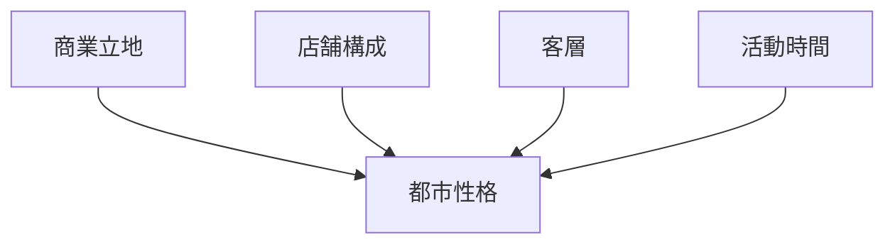
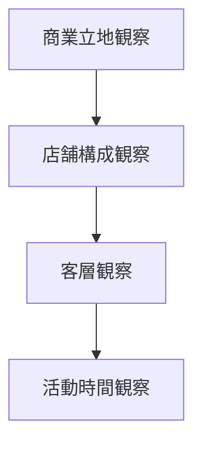

# 商業観察チェックリスト

## 概要

商業観察チェックリストとは  
**都市や地域の商業活動を観察する際に確認すべき要素を整理したチェックリスト**である。

商業は

- 都市の中心
- 都市機能
- 観光
- 地域文化

を強く反映する。

そのため商業を観察することで

- 都市の性格
- 地域の生活
- 観光構造

を理解することができる。

---

## 商業観察の基本構造

---

## 1 商業立地

商業施設の立地を観察する。

観察項目

- 商店街
- 駅前
- 観光地
- 住宅地

確認するポイント

- 商業中心
- 商業集積

---

## 2 店舗構成

店舗の種類を観察する。

観察項目

- 飲食店
- 小売店
- 観光店
- サービス業

確認するポイント

- 店舗の多様性
- 専門店

---

## 3 客層

利用者の属性を観察する。

観察項目

- 観光客
- 地元住民
- 学生
- ビジネス客

確認するポイント

- 客層の偏り
- 観光依存

---

## 4 活動時間

商業活動の時間を観察する。

観察項目

- 昼
- 夜
- 休日

確認するポイント

- 営業時間
- 活動ピーク

---

## 商業タイプ

代表的な商業タイプ。

### 観光型商業

特徴

- 観光客中心
- 土産店

例

- 京都
- 金沢

---

### 生活型商業

特徴

- 地元住民中心
- 日用品

例

- 地方都市中心街

---

### 繁華街型商業

特徴

- 夜間活動
- 飲食店

例

- 新宿
- 大阪ミナミ

---

## 商業観察の順序

---

## フィールドワークでの質問

商業を見るときは次を考える。

1 商業はどこに集中しているか  
2 どんな店が多いか  
3 客層は誰か  
4 活動時間はどうか  

---

## 例

### 京都

商業立地

- 祇園
- 河原町

店舗構成

- 飲食店
- 観光店

客層

- 観光客

活動時間

- 昼夜両方

---

### 金沢

商業立地

- 近江町市場
- 東茶屋街

店舗構成

- 飲食
- 観光

客層

- 観光客
- 地元

活動時間

- 昼中心

---

## 商業観察の目的

このチェックリストの目的は以下である。

- 都市機能理解  
- 観光構造理解  
- 地域生活理解  

---

## 関連ノート

- [[02_zettelkasten/21_domain/fieldwork_tourism/04_method/07_observation/05_urban_observation/都市観察チェックリスト]]
- [[観光資源評価フレーム]]
- [[都市レイヤー]]
- [[活動景観]]