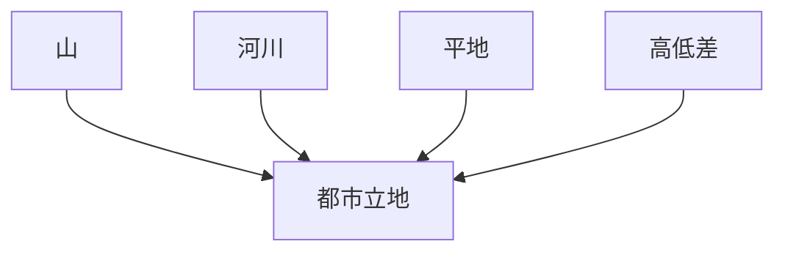
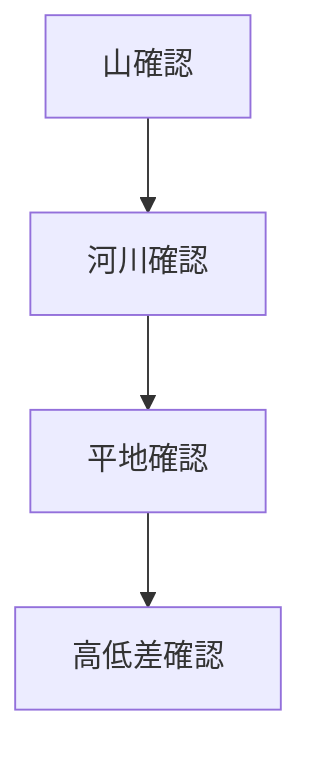

# 地形観察チェックリスト

## 概要

地形観察チェックリストとは  
**都市や地域の地形を観察する際に確認すべき要素を整理したチェックリスト**である。

都市は

- 防御
- 水資源
- 交通
- 農業

などの理由で特定の地形に成立する。

そのためフィールドワークでは  
**まず地形を理解すること**が重要である。

---

## 地形観察の基本構造

---

## 1 山地

周囲の山地を観察する。

観察項目

- 山の位置
- 山の高さ
- 山の形

確認するポイント

- 防御性
- 景観
- 都市の方向

---

## 2 河川

河川の存在は都市形成に重要である。

観察項目

- 河川の位置
- 河川の流れ
- 橋

確認するポイント

- 水利用
- 交通
- 境界

---

## 3 平地

都市が成立する平地を観察する。

観察項目

- 台地
- 扇状地
- 自然堤防
- 盆地

確認するポイント

- 洪水リスク
- 農業
- 交通

---

## 4 高低差

地形の高低差を観察する。

観察項目

- 崖
- 段丘
- 坂

確認するポイント

- 防御
- 景観
- 都市構造

---

## 代表的な地形タイプ

### 台地

特徴

- 洪水に強い
- 防御性

例

- 武蔵野台地

---

### 河岸段丘

特徴

- 高低差
- 水利用

例

- 金沢
- 京都

---

### 扇状地

特徴

- 農業
- 水資源

例

- 甲府
- 松本

---

### 谷

特徴

- 水資源
- 防御

例

- 鎌倉

---

## 地形観察の順序

---

## フィールドワークでの質問

地形を見るときは次を考える。

1 山はどこにあるか  
2 川はどこにあるか  
3 平地はどこか  
4 高低差はあるか  

---

## 例

### 金沢

山

- 卯辰山

河川

- 浅野川
- 犀川

平地

- 河岸段丘

高低差

- 小立野台地

---

## 地形観察の目的

このチェックリストの目的は以下である。

- 都市立地理解  
- 都市構造理解  
- 歴史理解  

---

## 関連ノート

- [[地形解釈]]
- [[02_zettelkasten/21_domain/photography/photo_fieldwork/フィールドワーク観察]]
- [[都市構造分析フレーム]]
- [[河岸段丘]]